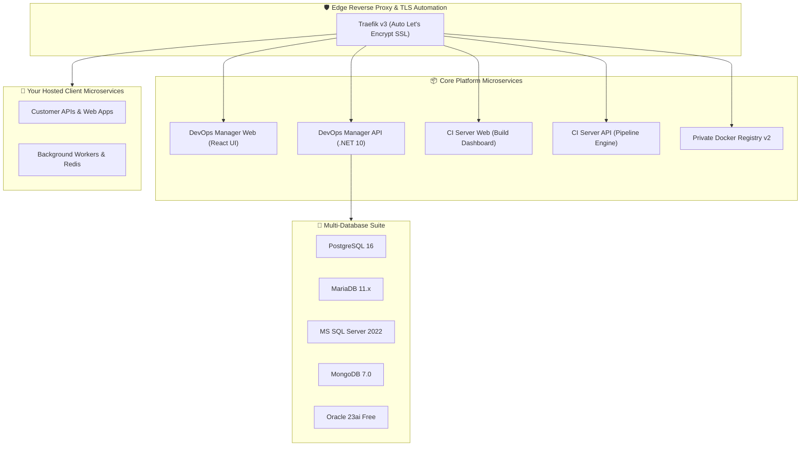

# 🚀 VPS-Infra: Client DevOps Administration & Deployment Guide

Welcome to the **VPS-Infra Platform**. This comprehensive runbook provides everything your DevOps, SysAdmin, and Engineering teams need to deploy, configure, secure, and maintain the VPS-Infra suite.

---

## 🏛️ 1. Infrastructure Architecture

VPS-Infra delivers a production-ready, cloud-native runtime on single or multi-tenant VPS instances:



### 📦 Pre-Built Container Image Distribution:
All core services are distributed as pre-compiled, production-hardened container images via GitHub Container Registry (`ghcr.io`). **No compilers, SDKs, or raw source code are required on the host server**:
* `ghcr.io/tmk-computers/tmk-devops-api:latest`
* `ghcr.io/tmk-computers/tmk-devops-web:latest`
* `ghcr.io/tmk-computers/tmk-ci-api:latest`
* `ghcr.io/tmk-computers/tmk-ci-web:latest`

---

## 💻 2. System & Hardware Prerequisites

Ensure your target server meets the following specifications before beginning installation:

| Requirement | Minimum | Recommended Production |
|---|---|---|
| **OS** | Ubuntu 22.04 LTS / 24.04 LTS | Ubuntu 24.04 LTS (x86_64) |
| **CPU** | 2 vCPUs | 4 – 8+ vCPUs |
| **Memory (RAM)** | 4 GB | 8 GB – 16 GB+ |
| **Disk Storage** | 40 GB NVMe / SSD | 100 GB+ High-Speed SSD |
| **Docker Engine** | Docker v24.0+ | Docker v26.0+ & Compose v2 |
| **Network Ports** | `80/tcp`, `443/tcp` open to internet | `80/tcp`, `443/tcp` |

---

## 🚀 3. Step-by-Step Production Installation

### Step 1: Clone the Runtime Repository
Clone this repository to `/var/www/vps-infra`:
```bash
git clone https://github.com/tmk-computers/vps-infra.git /var/www/vps-infra
cd /var/www/vps-infra
```

### Step 2: Configure Environment Variables
Copy `.env.example` to `.env`:
```bash
cp .env.example .env
nano .env
```

Configure your core values:
```ini
# 1. ENTERPRISE LICENSE
TMK_LICENSE_KEY="eyJjbGllbnRJZCI6..." # Supplied by TMK Computers

# 2. BRANDING & DOMAIN CONFIGURATION
COMPANY_NAME="Acme Corp"
PRIMARY_DOMAIN=yourdomain.com
ACME_SSL_EMAIL=admin@yourdomain.com

# 3. INITIAL SUPERADMIN CREDENTIALS
SUPERADMIN_EMAIL=admin@yourdomain.com
SUPERADMIN_PASSWORD=YourSecureSuperAdminPassword123!

# 4. DEPLOYMENT TOPOLOGY & REGISTRY
DEPLOYMENT_MODE=all-in-one          # all-in-one | devops-only | ci-only
COMPOSE_PROFILES=all               # all | devops | ci
DOCKER_REGISTRY_TYPE=private       # private | external
DOCKER_REGISTRY_HOST=localhost:5000 # or ghcr.io/your-org or registry.yourdomain.com
DOCKER_REGISTRY_USER=your_registry_user         # Required for private registry
DOCKER_REGISTRY_PASSWORD=your_secure_password   # Generate a unique strong password; do not use defaults
SYNC_MODE=api                      # api (REST Sync) | db (Direct DB)
CI_SECRET=[REDACTED_COMPROMISED_DEFAULT]     # Shared token for cross-machine REST sync

# 5. SECURE CORS RESTRICTIONS (Optional, for separate CI domains)
# ALLOWED_CORS_ORIGINS=https://ci.machine-a.yourdomain.com
```

### Step 3: Run the Turn-Key Bootstrap Script
Execute the deployment script:
```bash
chmod +x setup.sh
./setup.sh
```

#### What `setup.sh` Automatically Provisions:
1. **Interactive Domain Discovery**: Validates your primary domain (`yourdomain.com`) and automatically derives all service hostnames (`devops.yourdomain.com`, `ci.yourdomain.com`, `registry.yourdomain.com`, etc.).
2. **PostgreSQL Cold-Start Readiness**: Waits for PostgreSQL to be healthy and accepting connections before starting platform application services, ensuring seamless SuperAdmin seeding.
3. **Docker Log Rotation**: Automatically writes `/etc/docker/daemon.json` (`max-size: 50m`, `max-file: 3`) and restarts the Docker service to prevent container log growth from filling VPS storage.
4. **Registry Authentication**: Pre-authenticates the Docker daemon with `REG_TARGET`, `localhost:5000`, and `127.0.0.1:5000`.
5. **Automated System Maintenance Crons**: Installs `/etc/cron.d/vps-infra-maintenance` to run:
   - **Daily at 3:00 AM IST**: Disk & builder cache prune (`scripts/clean-storage.sh`).
   - **Daily at 3:30 AM IST**: Docker Registry tag prune keeping latest 5 tags per repo (`scripts/prune-registry-tags.sh`).
   - **Daily at 4:00 AM IST**: Automated database backup retention prune (`scripts/prune-backups.sh`).

> **Automated Deployment Options**:
> - **All-in-One (Single VPS)**:
>   ```bash
>   ./setup.sh --mode all-in-one --domain "yourdomain.com" --license "YOUR_LICENSE_KEY"
>   ```
> - **Distributed Machine A (Dedicated CI Server)**:
>   ```bash
>   ./setup.sh --mode ci-only --sync-mode api --ci-secret "YOUR_SECRET"
>   ```
> - **Distributed Machine B (DevOps Manager & Apps Host)**:
>   ```bash
>   ./setup.sh --mode devops-only --ci-secret "YOUR_SECRET"
>   ```
>
> 📖 **Full Architectural Guide**: See [DUAL_TOPOLOGY_DEPLOYMENT_GUIDE.md](../03-OPERATIONS-AND-DEVOPS/DUAL_TOPOLOGY_DEPLOYMENT_GUIDE.md) for network diagrams, sequence flows, and disaster recovery.

---

## 🌐 4. DNS Records Configuration

Configure the following **A Records** with your DNS provider (Cloudflare, Route53, GoDaddy, etc.) pointing to your VPS public IP:

| Subdomain | Target | Purpose |
|---|---|---|
| `@` | `YOUR_SERVER_IP` | Primary Landing Page |
| `devops` | `YOUR_SERVER_IP` | DevOps Manager Web Dashboard |
| `devops-api` | `YOUR_SERVER_IP` | DevOps Backend REST API |
| `ci` | `YOUR_SERVER_IP` | CI/CD Build Pipeline Dashboard |
| `ci-api` | `YOUR_SERVER_IP` | CI Build Webhooks & Artifact Streaming |
| `registry` | `YOUR_SERVER_IP` | Private Docker Image Registry |
| `pgadmin` | `YOUR_SERVER_IP` | PostgreSQL Web Management Interface |
| `traefik` | `YOUR_SERVER_IP` | Traefik Router & TLS Status Dashboard |

---

## 🔑 5. Enterprise License Lifecycle & Scenarios

VPS-Infra enforces hardware-locked cryptographic licensing. Below are the standard operational scenarios and step-by-step resolution guides:

---

### 🚨 Scenario 1: Fresh VPS Cloned Without a License Key (Unlicensed Lockout)
**What Happens:**
If a new client clones the repository and starts the framework without providing a valid `TMK_LICENSE_KEY` in `.env`:
1. **API Behavior**: The backend API rejects all project creations, git deployments, and database mutations with **`HTTP 402 Payment Required`**.
2. **Dashboard UI**: The web frontend displays the **Subscription Lockout Screen**:
   > *"Enterprise License Required: No active license key was found for this installation. Please contact TMK Computers to activate your server."*
3. **Hardware Fingerprint**: The screen displays your unique **Server Hardware Fingerprint** (e.g. `b9e4ee73b6b7a630...`).

**How to Activate:**
1. Retrieve your server hardware fingerprint using any of these methods:
   ```bash
   # Method 1 (Recommended):
   docker exec ci-api-prod node -e "fetch('http://devops-api-prod:8080/api/License/fingerprint').then(r=>r.json()).then(d => console.log(d.serverFingerprint))"

   # Method 2 (Direct from Host Shell):
   echo -n "TMK-HW-$(cat /etc/machine-id)" | sha256sum | awk '{print $1}'

   # Method 3 (From Web UI):
   # Visit https://devops.yourdomain.com -> Click "Copy Fingerprint" on the lock screen
   ```
2. Send this fingerprint to **TMK Computers Licensing Team** (`licensing@tmkcomputers.in` or via your client account manager).
3. TMK Computers issues your cryptographic `TMK_LICENSE_KEY`.
4. Apply the key using any method:
   - **Method A (1-Click CLI Script - Recommended)**:
     ```bash
     cd /var/www/vps-infra
     ./activate-license.sh "YOUR_SIGNED_TOKEN_HERE"
     ```
   - **Method B (Web Dashboard)**:
     Paste the token directly into the License Activation modal on your browser screen and click **Activate License**.
   - **Method C (Initial Bootstrap Flag)**:
     ```bash
     ./setup.sh --license "YOUR_SIGNED_TOKEN_HERE"
     ```
5. Refresh your browser — all services, features, and database engines instantly unlock with full enterprise access.

---

### ⏳ Scenario 2: License Has Expired or Been Revoked (Renewal Flow)
**What Happens:**
When your license duration reaches `0 days` (or if your agreement is suspended):
1. **API & Deployment Freeze**: Automated build runners, deployments, and database provisioning are halted with an error message:
   > *"License Expired: Your enterprise subscription expired on YYYY-MM-DD. Please renew your subscription to resume operations."*
2. **Data Preservation**: **100% of your databases, customer uploads, APKs, and volumes remain completely safe and intact** on disk. No data is lost.
3. **Renewal Screen**: The dashboard displays a renewal prompt with an activation input and quick contact link.

**How to Renew:**
1. Contact TMK Computers for subscription renewal.
2. Once you receive your renewed `TMK_LICENSE_KEY`, apply it in one command:
   ```bash
   cd /var/www/vps-infra
   ./activate-license.sh "YOUR_NEW_RENEWED_TOKEN"
   ```
3. The Navbar badge updates immediately (e.g., `Enterprise Ultimate • 365d`) and all platform capabilities resume instantly.

---

## 🔐 6. Production Secret Management & Host Secrets Architecture (`/etc/vps-infra/secrets/`)

To achieve enterprise-grade isolation, compliance, and prevent credential leakage into version control, VPS-Infra enforces strict secret externalization and host-level filesystem security.

### 🛡️ Core Security Principles
1. **Zero Hardcoded Secrets in Git**: Never place database passwords, third-party API tokens (e.g., MailGun, Twilio, SendGrid), private keys, or JWT signing secrets directly inside `docker-compose.yml`, source code, or repository `.env` files.
2. **Application-Scoped Secret Isolation**: Never inject the global platform `.env` file into client containers. Every microservice must receive strictly its own application-specific environment file.
3. **Least-Privilege Database Roles**: Application containers must **never** connect using database superuser accounts (such as PostgreSQL `postgres` or MySQL `root`). Each application database must have its own dedicated user account with privileges strictly limited to that database.
4. **Build-Time Leak Prevention**: Every repository must contain a hardened `.dockerignore` file so secret files (`.env*`, `*.pem`, `*.key`), dumps, and local test artifacts are never baked into Docker images during CI builds.

---

### 📂 Host Secrets Directory Structure (`/etc/vps-infra/secrets/`)

Application secrets reside outside the `/var/www/vps-infra` git repository under the secure root directory `/etc/vps-infra/secrets/`:

```text
/etc/vps-infra/secrets/
├── [drwx------ root:root]  clever-bill-api/
│   ├── [-rw------- root:root]  prod.env
│   └── [-rw------- root:root]  uat.env
├── [drwx------ root:root]  clever-farmer-api/
│   ├── [-rw------- root:root]  prod.env
│   └── [-rw------- root:root]  uat.env
├── [drwx------ root:root]  clever-lord-api/
│   ├── [-rw------- root:root]  prod.env
│   └── [-rw------- root:root]  uat.env
├── [drwx------ root:root]  clever-sales-api/
│   ├── [-rw------- root:root]  prod.env
│   └── [-rw------- root:root]  uat.env
├── [drwx------ root:root]  kaksha-plus-api/
│   ├── [-rw------- root:root]  prod.env
│   ├── [-rw------- root:root]  uat.env
│   ├── [-rw------- root:root]  dev.env
│   └── [-rw------- root:root]  qa.env
└── [drwx------ root:root]  omr-api/
    ├── [-rw------- root:root]  prod.env
    └── [-rw------- root:root]  uat.env
```

### 🔒 Permission Matrix & Hardening Commands

The host secrets directory is secured so that only the Linux `root` user can read or modify credentials:

```bash
# Set directory permissions (accessible only by root)
sudo chown -R root:root /etc/vps-infra/secrets
sudo find /etc/vps-infra/secrets -type d -exec chmod 0700 {} +

# Set file permissions (read/write only by root)
sudo find /etc/vps-infra/secrets -type f -exec chmod 0600 {} +
```

---

### 📝 Client Manifest Integration (`docker-compose.yml`)

Microservice Compose manifests in `/var/www/vps-infra/apps/<app>/docker-compose.yml` load secrets at runtime using the `env_file:` declaration. Non-secret configurations remain cleanly separated under `environment:`:

```yaml
services:
  my-api-prod:
    image: localhost:5000/my-api:${IMAGE_TAG:-prod}
    container_name: my-api-prod
    restart: always

    # 1. Load sensitive credentials from application-scoped host secrets
    env_file:
      - /etc/vps-infra/secrets/my-api/prod.env

    # 2. Non-sensitive operational configuration
    environment:
      - ASPNETCORE_ENVIRONMENT=Production
      - ASPNETCORE_URLS=http://+:8080

      # Centralized Maintenance Mode Support
      - SystemStatus__IsMaintenance=false
      - SystemStatus__StatusMessage=All systems operational.
      - SystemStatus__Version=1.0.0
      - SystemStatus__MinSupportedVersion=1.0.0
      - SystemStatus__ShowMaintenanceForMobile=true
      - SystemStatus__ShowMaintenanceForWeb=true

    volumes:
      - /var/www/vps-infra/volumes/apps/my-api/prod/uploads:/app/uploads
      - /var/www/vps-infra/volumes/apps/my-api/prod/logs:/app/logs
    networks:
      - traefik_net
```

### 📄 Example Secret File (`/etc/vps-infra/secrets/my-api/prod.env`)
```ini
# Application Database Connection (Dedicated Least-Privilege Role)
ConnectionStrings__DefaultConnection=Host=shared_postgres;Port=5432;Database=my_api_prod;Username=my_api_prod_user;Password=SecureCryptographicPassword32Chars!;Pooling=true;MaxPoolSize=10;

# Third-Party API Keys & Tokens
MailGun__ApiKey=key-abcdef1234567890
MailGun__Domain=mail.yourdomain.com

# Security Tokens
JwtSettings__SecretKey=Your64CharacterHighEntropyHmacSha256SecretKeyHere!
```

---

### 🛡️ Least-Privilege Database User Provisioning

When provisioning a new application database on `shared_postgres`:

1. **Create the dedicated user with a strong unique password**:
   ```sql
   CREATE USER my_api_prod_user WITH PASSWORD 'Generate32CharSecretHere!';
   CREATE DATABASE my_api_prod OWNER my_api_prod_user;
   ```
2. **Transfer schema ownership to support startup migrations (EF Core / Flyway)**:
   ```sql
   \c my_api_prod
   GRANT ALL ON SCHEMA public TO my_api_prod_user;
   ALTER SCHEMA public OWNER TO my_api_prod_user;
   ```
3. **Revoke cross-database permissions**:
   ```sql
   REVOKE ALL ON DATABASE my_api_prod FROM PUBLIC;
   GRANT CONNECT ON DATABASE my_api_prod TO my_api_prod_user;
   ```

---

### 📦 Mandatory `.dockerignore` Rules

To ensure secrets, local environments, and build artifacts never leak into Docker image layers, every repository must include a `.dockerignore` file containing:

```text
# Dependency & build directories
node_modules/
dist/
bin/
obj/
__pycache__/

# Secret & environment files
.env*
*.pem
*.key
*.pfx

# Database dumps & backup archives
*.dump
*.sql
*.tar.gz
*.zip
*.rar

# Source control & CI logs
.git/
.github/
*.log
coverage/
playwright-report/
test-results/
```

---

## 🔄 7. Release & Hotfix Updates (Client Upgrade Runbook)

When TMK Computers releases new features, performance updates, or security hotfixes:

### Step 1: Pull the Updated Orchestration Scripts
```bash
cd /var/www/vps-infra
git pull origin main
```

### Step 2: Download the New Pre-Built Container Images
```bash
docker compose pull
```
*(Docker pulls the new pre-compiled images from `ghcr.io/tmk-computers/tmk-*` in seconds without requiring compilers or build tools).*

### Step 3: Apply the Update (Zero-Downtime)
```bash
docker compose up -d --remove-orphans
```

### 🛡️ What is Preserved During Updates:
* ✅ All active databases (PostgreSQL, MariaDB, MSSQL, Mongo, Oracle) maintain their data.
* ✅ All customer uploads, APKs, and build artifacts in `/var/www/vps-infra/volumes/` are untouched.
* ✅ All custom `.env` domain settings, SSL certificates, and license tokens remain intact.

---

## 🛠️ 8. Day-2 Operations Runbook

### Service Lifecycle Management:
```bash
# Check running container health
docker compose ps

# View live consolidated logs
docker compose logs -f

# Restart core API services
docker compose restart devops-api-prod devops-web-prod
```

### Database Engine Administration:
VPS-Infra includes a dedicated database management CLI tool in `db/`:
```bash
# Check status of all database engines
./db/manage-databases.sh status

# Start or stop individual database engines on demand:
./db/manage-databases.sh start postgres
./db/manage-databases.sh start mariadb
./db/manage-databases.sh start mongodb
./db/manage-databases.sh start sql-server
./db/manage-databases.sh start oracle
```

---

## 📞 9. Enterprise Support & Contact

For assistance, custom extensions, or licensing renewals:
* **Support Email**: `support@tmkcomputers.in`
* **Enterprise Portal**: [https://tmkcomputers.in](https://tmkcomputers.in)
* **Documentation**: [https://docs.tmkcomputers.in](https://docs.tmkcomputers.in)

---

*© 2026 TMK Computers. All Rights Reserved.*
