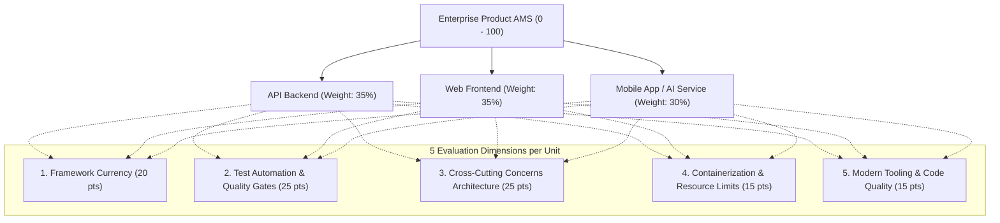

# 📊 Application Modernization Score (AMS) Architecture & Operations Guide

## 1. Executive Overview

The **Application Modernization Score (AMS)** is a continuous architectural assessment engine embedded directly within the **VPS-INFRA Continuous Integration (CI) Server** (`/var/www/vps-infra-server/ci-server`). 

It provides automated, quantitative architectural governance (scored from **0 to 100**) across all enterprise products, individual deployable units (`api`, `web`, `mobile`, `ai-service`), and Cross-Cutting Concerns (CCC).



---

## 2. Evaluation Dimensions & Scoring Rubric

Every deployable unit is rigorously evaluated on a **100-point rubric** across five architectural pillars:

### Dimension 1: Framework & Runtime Currency (Max 20 Points)
Evaluates whether the application is running on supported, high-performance, modern LTS or current runtimes:
- **.NET Backends (`.csproj`):**
  - `.NET 10.0` (Latest Preview / Edge Architecture): **20 pts**
  - `.NET 9.0` (Standard Term Support): **18 pts**
  - `.NET 8.0` (Long Term Support - LTS): **15 pts**
  - `.NET 6.0 / 7.0` (End-of-Support / Deprecated): **8 pts**
  - Legacy `.NET Core 3.1` or `.NET Framework 4.x`: **2 pts**
- **Java / Spring Boot (`pom.xml` / `build.gradle`):**
  - `Java 21+ LTS` (Virtual Threads / Project Loom): **20 pts**
  - `Java 17 LTS`: **16 pts**
  - `Java 11 LTS`: **10 pts**
  - `Java 8` (End-of-Life): **2 pts**
- **Web Frontends (`package.json`):**
  - `React 19 + Vite` (React Compiler & Server Actions): **20 pts**
  - `Angular 18/19` (Signals & Standalone Architecture): **20 pts**
  - `React 18 + Vite`: **18 pts**
  - `React 18 + Webpack / CRA`: **14 pts**
  - Legacy React (`< 18`): **6 pts**
- **Mobile Applications (`package.json`, `pubspec.yaml`, `build.gradle.kts`):**
  - `Flutter 3.24+ / Dart 3.11+` (Impeller Engine & Pattern Matching): **20 pts**
  - `React Native 0.74+ / Expo SDK 51/54+` (New Architecture): **20 pts**
  - `Android SDK 35/37` (Targeting Android 15/16 Latest Play Store Standard): **20 pts**
  - Android SDK 34 / Expo SDK 49: **18 pts**
- **AI Services & Python (`Dockerfile`, `requirements.txt`, `pyproject.toml`):**
  - `Python 3.12+ + FastAPI`: **20 pts**
  - `Python 3.11 + FastAPI`: **18 pts**
  - `Python 3.10`: **14 pts**
  - Legacy Python (`<= 3.9`): **8 pts**

---

### Dimension 2: Test Automation & Quality Gates (Max 25 Points)
Measures automated verification rigor and regression prevention:
1. **Automated Unit Tests Configured (+10 pts):**
   - Unit test suites present (`tests/`, `test/`, `__tests__/`, `*.Tests/`, `xunit`, `vitest`, `jest`, `pytest`, `JUnit`).
2. **Dedicated Integration / E2E Testing Suite (+6 pts):**
   - Playwright, Cypress, WebApplicationFactory, `integration_test/`, `androidTest/`.
   - Partial score (+3 pts) awarded if extensive controller/service integration scripts exist.
3. **Verified Code Coverage Gate (+9 pts):**
   - Coverage $\ge 75\%$: **+9 pts**
   - Coverage $50\% - 74.9\%$: **+6 pts**
   - Coverage $25\% - 49.9\%$: **+3 pts**
   - Coverage $< 25\%$ or unverified: **0 pts**

---

### Dimension 3: Cross-Cutting Concerns (CCC) Architecture (Max 25 Points)
Evaluates enterprise operational maturity (5 pts per concern):
1. **Centralized Authentication & Token Lifecycle (+5 pts):**
   - Backend JWT validation, ClaimsPrincipal, automatic token refresh lifecycle (`refreshToken`), SecureStore.
2. **Global Error Handling & Resilience (+5 pts):**
   - Global exception handling middleware, React `ErrorBoundary`, standard `ProblemDetails` responses.
3. **Centralized Maintenance Mode (+5 pts):**
   - HTTP 503 circuit-breaker middleware (`MaintenanceModeMiddleware` / `MaintenanceModeFilter`) and synchronized client overlay (`<MaintenanceOverlay />`).
4. **Health & Liveness Probes (+5 pts):**
   - Standardized `/health` or `/healthz` endpoints, Docker container health checks, connectivity listeners.
5. **Structured Logging & Observability (+5 pts):**
   - Structured JSON logging (Serilog, Winston, Logback, OpenTelemetry) with request correlation IDs.

---

### Dimension 4: Containerization & 12-Factor Hygiene (Max 15 Points)
Evaluates cloud-native deployment readiness:
1. **Multi-Stage Dockerfile (+5 pts):**
   - Minimal runtime images (`alpine`, `slim`, `distroless`) decoupled from build SDKs. (Mobile equivalent: reproducible EAS/Fastlane build configs).
2. **Memory & CPU Limits Enforced (+4 pts):**
   - Explicit container caps (`mem_limit: 512m`, `cpus: 1.0`, `DOTNET_GCHeapHardLimitPercent`, `--max-old-space-size`).
3. **Non-Root Execution (+3 pts):**
   - Least privilege execution (`USER app`, `USER node`, or non-root UID).
4. **Secret & 12-Factor Config Segregation (+3 pts):**
   - Clean environment variable segregation via `.env.example` templates with zero committed plaintext passwords.

---

### Dimension 5: Modern Tooling & Code Quality (Max 15 Points)
Evaluates developer productivity and build reproducibility:
1. **Static Type Safety (+6 pts):**
   - TypeScript (`tsconfig.json`), statically typed C#, Java, Kotlin, Dart, or Python type hints (`pydantic`/`mypy`).
2. **Modern Bundler & Styling Pipeline (+5 pts):**
   - Vite, TailwindCSS, ASP.NET Minimal APIs, Flutter AOT compiler, Android Gradle KTS.
3. **Deterministic Dependency Management & Linting (+4 pts):**
   - Strict lockfiles (`package-lock.json`, `pubspec.lock`, `pom.xml`, `Directory.Packages.props`) (+2 pts).
   - Automated linters (`eslint`, `biome`, `analysis_options.yaml`, `editorconfig`) (+2 pts).

---

## 3. Letter Grade Classifications

| Score Range | Grade | Architectural Classification | Action Required |
| :---: | :---: | :--- | :--- |
| **95.0 – 100.0** | **A+** | Exemplary Cloud-Native & Modern Architecture | Maintain high test and container hygiene |
| **85.0 – 94.9** | **A** | Modernized Enterprise Architecture | Minor optimization items |
| **75.0 – 84.9** | **B** | Healthy with Minor Technical Debt | Address top prioritized remediations |
| **65.0 – 74.9** | **C** | Moderate Technical Debt | Schedule framework/testing remediation sprint |
| **50.0 – 64.9** | **D** | Legacy Runtime or Low Quality Gates | Critical modernization required |
| **< 50.0** | **F** | High Technical Risk | Immediate refactoring or migration |

---

## 4. Current Baseline Scores Across Products

Based on live scanning of all 21 deployable units in `/var/www/vps-infra/code`:

| Product | Overall AMS | Grade | Deployable Units Breakdown | CCC Compliance |
| :--- | :---: | :---: | :--- | :---: |
| **Clever Lord** | **87.5** | **A** | API: 84 (B) • Mobile: 91 (A) • Web: 88 (A) | **93%** |
| **Clever Sales** | **87.2** | **A** | API: 93 (A) • Mobile: 83 (B) • Web: 85 (A) | **87%** |
| **Kaksha Plus** | **86.3** | **A** | API: 90 (A) • Mobile: 88 (A) • Web: 81 (B) | **93%** |
| **Clever Farmer** | **83.3** | **B** | API: 84 (B) • Mobile: 77 (B) • Web: 88 (A) | **87%** |
| **OMR** | **77.1** | **B** | AI-Service: 68 (C) • API: 84 (B) • Web: 78 (B) | **67%** |
| **Bank Mitra** | **74.2** | **C** | API: 79 (B) • Mobile: 64 (D) • Web: 78 (B) | **53%** |
| **Clever Bill** | **72.0** | **C** | API: 58 (D) • Mobile: 80 (B) • Web: 79 (B) | **60%** |
| **Platform Summary** | **81.1** | **B** | **21 Deployable Units across 7 Products** | **81%** |

---

## 5. CI Server REST API Endpoints

The CI Server exposes the following REST endpoints under both `/api/ci/modernization/*` and `/api/modernization/*`:

### 1. Global Platform Summary
```http
GET /api/ci/modernization/summary
```
**Response (200 OK):**
```json
{
  "platformScore": 81.1,
  "platformGrade": "B",
  "platformGradeDescription": "Healthy with Minor Technical Debt",
  "totalProducts": 7,
  "totalDeployableUnits": 21,
  "gradeDistribution": {
    "A+": 0,
    "A": 3,
    "B": 2,
    "C": 2,
    "D": 0,
    "F": 0
  },
  "cccCompliance": {
    "auth": 86,
    "errorHandling": 71,
    "maintenanceMode": 76,
    "healthChecks": 62,
    "structuredLogging": 90
  },
  "calculatedAt": "2026-09-29T11:34:10.123Z"
}
```

### 2. List All Products with Unit Highlights
```http
GET /api/ci/modernization/products
```

### 3. Single Product Inspection
```http
GET /api/ci/modernization/products/:productId
```
*Example: `/api/ci/modernization/products/clever-sales`*

### 4. On-Demand Product Recalculation
```http
POST /api/ci/modernization/calculate/:productId
Authorization: Bearer <TOKEN>
```

### 5. Platform-Wide Recalculation
```http
POST /api/ci/modernization/calculate-all
Authorization: Bearer <TOKEN>
```

---

## 6. Accessing AMS on the UI

The Application Modernization Score (AMS) is available across two primary administrative interfaces:

### Option A: Directly in DevOps Manager Panel (Recommended)
Accessible via `https://devops.tmkcomputers.in` (or local DevOps Manager URL):
1. Navigate to **Product Suites & Maintenance** (`/products` in the sidebar).
2. Look at the **AMS Health Score** column in the Products table:
   - Each product displays an interactive letter grade pill and numerical score:
     - `[A] 87.2 / 100` (Emerald for A/A+)
     - `[B] 83.3 / 100` (Sky for B)
     - `[C] 74.9 / 100` (Amber for C)
3. Click on the badge or the **"Inspect"** button (`chart-timeline-variant-shimmer` icon):
   - Opens the **Enterprise Application Modernization Score (AMS) Inspection Modal**:
     - **Hero Banner:** Product Score, Letter Grade, and Grade Description.
     - **On-Demand Recalculation:** "Recalculate Score" button that immediately rescans the codebase and live-refreshes the score.
     - **Cross-Cutting Concerns (CCC) Posture:** 5 enterprise status cards for Authentication & RBAC, Global Error Handling, Centralized Maintenance Mode, Health Probes, and Structured Logging.
     - **Deployable Units Grid:** Filter by unit type (`API`, `Web`, `Mobile`, `AI Service`) to inspect framework currency, container hygiene, test automation, and code tooling per repository.
     - **High-Impact Remediation Roadmap:** Top prioritized suggestions with concrete estimated score boosts (e.g. `+5.0 pts: Add Non-root user in Dockerfile`).

### Option B: Dedicated Modernization Index in CI Server UI
Accessible via `https://ci.tmkcomputers.in`:
1. In the top navigation bar, click the **"Modernization Index"** tab (next to *Build Logs*).
2. Features the global platform health banner, grade distribution counters, grade filters (`ALL`, `A+`, `A`, `B`, `C`, `D`, `F`), and product score cards.

---

## 7. Automated Test Suite

The AMS engine is validated using Node.js's native test runner (`node --test`):

```bash
# Run AMS engine tests
node --test test/modernization-engine.test.js

# Run AMS API contract tests
node --test test/modernization-api.test.js
```

All 9 test suites pass with 100% success covering unit type inference, grade brackets, framework currency detection across .NET 10, Java 21, React 19, Flutter 3.24, Android, and Python 3.11, CCC compliance, and dynamic weighted score aggregation.
