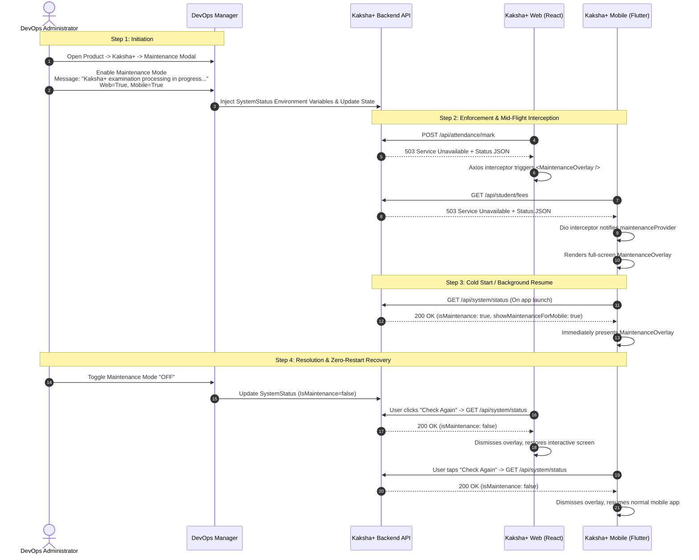

# 🔧 Centralized System Maintenance Mode Guide

This guide documents the architecture, operational runbook, and end-to-end execution flow of the **Centralized System Maintenance Mode** across DevOps Manager, backend APIs, web frontends, and mobile applications in the VPS-Infra ecosystem.

---

## 1. Architecture Overview

Centralized Maintenance Mode allows DevOps administrators to place any product or deployable unit into maintenance mode from the **DevOps Manager UI** or API. 

When active, the backend intercepts business traffic with `HTTP 503 Service Unavailable`, while web and mobile clients gracefully display responsive, branded maintenance overlays with automated retry capabilities.

```
                              ┌──────────────────────────────────────────┐
                              │ DevOps Manager UI / Maintenance Service  │
                              └─────────────────────┬────────────────────┘
                                                    │
                 ┌──────────────────────────────────┴──────────────────────────────────┐
                 ▼                                                                     ▼
     [SystemStatus Configuration]                                          [Target Environment Override]
     • IsMaintenance: true/false                                           • PROD / UAT / DEV / QA
     • StatusMessage: "Custom Message"                                     • ShowMaintenanceForWeb: true/false
     • ShowMaintenanceForMobile: true/false                                • ShowMaintenanceForMobile: true/false
                 │
                 ▼
     ┌────────────────────────────────────────────────────────┐
     │           Product Backend API Gateway / Middleware     │
     │      (ASP.NET Core / Spring Boot / Node.js Express)    │
     └───────────────────────────┬────────────────────────────┘
                                 │
           ┌─────────────────────┴─────────────────────┐
           ▼                                           ▼
 ┌───────────────────────────────┐           ┌────────────────────────────────┐
 │ Health Checks & Status        │           │ Protected Business Routes      │
 │ • GET /healthz -> 200 OK      │           │ • GET/POST /api/students       │
 │ • GET /api/system/status      │           │ • POST /api/attendance/mark    │
 │   -> 200 OK (Status JSON)     │           │ -> 503 Service Unavailable     │
 └──────────────┬────────────────┘           └──────────────┬─────────────────┘
                │                                           │
                ├───────────────────────────────────────────┤
                ▼                                           ▼
  ┌──────────────────────────────┐            ┌──────────────────────────────┐
  │     Frontend Web Portals     │            │      Native & Hybrid Apps    │
  │   (React / Vite / Angular)   │            │  (Flutter / RN / Android)    │
  │ • Axios 503 Interceptor      │            │ • Dio / OkHttp / Fetch 503   │
  │ • <MaintenanceOverlay />     │            │ • AppLifecycle / State Check │
  │ • Zero-Reload "Check Again"  │            │ • Modal Maintenance Screen   │
  └──────────────────────────────┘            └──────────────────────────────┘
```

---

## 2. Core API Contract & DTO Specification

### `GET /api/system/status`
Public endpoint returning the current maintenance state. Always returns `HTTP 200 OK` (even when maintenance mode is active).

#### Response Payload (`SystemStatusDto`):
```json
{
  "isMaintenance": true,
  "statusMessage": "Kaksha+ is undergoing scheduled examination system upgrades. Services will resume at 2:00 PM.",
  "version": "1.0.0",
  "minSupportedVersion": "1.0.0",
  "showMaintenanceForMobile": true,
  "showMaintenanceForWeb": true
}
```

### Intercepted Business Endpoint Response
When `IsMaintenance == true`, all other endpoints return `HTTP 503 Service Unavailable`:

#### HTTP 503 Payload:
```json
{
  "isMaintenance": true,
  "statusMessage": "Kaksha+ is undergoing scheduled examination system upgrades. Services will resume at 2:00 PM.",
  "message": "Kaksha+ is undergoing scheduled examination system upgrades. Services will resume at 2:00 PM."
}
```

---

## 3. End-to-End Walkthrough Example: Kaksha+ Maintenance

This concrete scenario walks through placing **Kaksha+ School ERP** under maintenance during an annual examination grade publishing window.



---

### Step 1: DevOps Manager Initiation

1. Navigate to **DevOps Manager UI** (`https://devops.tmkcomputers.in` or local portal).
2. Go to **Products** and click on **Kaksha+**.
3. Click the **"Maintenance Mode"** button on the product details page.
4. Fill in the parameters:
   - **Status:** `Active (Checked)`
   - **Maintenance Message:** `"Kaksha+ examination processing in progress. Normal access will resume at 2:00 PM."`
   - **Show on Web:** `true`
   - **Show on Mobile:** `true`
   - **Environment:** `All Environments` (or target specific UAT/PROD)
5. Click **"Save Changes"**.
6. The DevOps Manager API updates the container runtime configuration:
   ```yaml
   # docker-compose.yml / Environment override
   - SystemStatus__IsMaintenance=true
   - SystemStatus__StatusMessage=Kaksha+ examination processing in progress. Normal access will resume at 2:00 PM.
   - SystemStatus__ShowMaintenanceForWeb=true
   - SystemStatus__ShowMaintenanceForMobile=true
   ```

---

### Step 2: Backend Enforcement (`kaksha-plus-api`)

The `MaintenanceModeMiddleware` runs at the entry of the ASP.NET Core request pipeline:

```csharp
public async Task InvokeAsync(HttpContext context)
{
    var path = context.Request.Path.Value?.ToLowerInvariant() ?? "";

    // 1. Bypass health checks and system status
    if (path.StartsWith("/health") || 
        path.StartsWith("/healthz") || 
        path.StartsWith("/api/system/status"))
    {
        await _next(context);
        return;
    }

    // 2. Intercept if maintenance is active
    if (_status.IsMaintenance)
    {
        context.Response.StatusCode = StatusCodes.Status503ServiceUnavailable;
        context.Response.ContentType = "application/json";
        
        var payload = new SystemStatusDto
        {
            IsMaintenance = true,
            StatusMessage = _status.StatusMessage,
            Version = _status.Version,
            ShowMaintenanceForMobile = _status.ShowMaintenanceForMobile,
            ShowMaintenanceForWeb = _status.ShowMaintenanceForWeb
        };

        await context.Response.WriteAsJsonAsync(payload);
        return;
    }

    await _next(context);
}
```

> [!IMPORTANT]
> The health check endpoints (`/health`, `/healthz`) remain functional and return `200 OK` during maintenance. This ensures Docker Swarm, Kubernetes, Traefik, and reverse proxies do not consider the container unhealthy or trigger restart loops.

---

### Step 3: Frontend Web Experience (`kaksha-plus-web`)

1. **Global Axios Response Interceptor:**
   When an in-flight API call returns `503`, the Axios interceptor in `src/services/api.ts` traps it and dispatches an event:
   ```typescript
   api.interceptors.response.use(
     (response) => response,
     (error) => {
       if (error.response?.status === 503) {
         const message = error.response.data?.statusMessage || error.response.data?.message;
         window.dispatchEvent(new CustomEvent('SYSTEM_MAINTENANCE_EVENT', {
           detail: { isMaintenance: true, message }
         }));
       }
       return Promise.reject(error);
     }
   );
   ```

2. **`<MaintenanceOverlay />` Component:**
   Mounted in the root layout (`src/App.tsx`), the component renders a non-dismissible modal:
   - Amber status badge: `MAINTENANCE IN PROGRESS`
   - Heading: `"System Under Maintenance"`
   - Exact message configured by the administrator in DevOps Manager.
   - Assurance callout: *"Student attendance, fee receipts, and exam records are safely preserved."*
   - **"Check Again"** button with automated state re-check.

---

### Step 4: Mobile App Experience (`kaksha-plus-mobile`)

The Flutter client incorporates two layers of protection:

1. **App Lifecycle & Cold Start Check (`lib/app.dart`):**
   ```dart
   @override
   void initState() {
     super.initState();
     WidgetsBinding.instance.addObserver(this);
     WidgetsBinding.instance.addPostFrameCallback((_) {
       ref.read(maintenanceProvider.notifier).checkStatus();
     });
   }

   @override
   void didChangeAppLifecycleState(AppLifecycleState state) {
     if (state == AppLifecycleState.resumed) {
       ref.read(maintenanceProvider.notifier).checkStatus();
     }
   }
   ```

2. **Dio 503 Network Interceptor (`lib/core/network/dio_provider.dart`):**
   ```dart
   onError: (error, handler) {
     if (error.response?.statusCode == 503) {
       String msg = 'Kaksha+ is currently undergoing scheduled maintenance.';
       final data = error.response?.data;
       if (data is Map && data['statusMessage'] != null) {
         msg = data['statusMessage'].toString();
       }
       ref.read(maintenanceProvider.notifier).setMaintenance(true, msg);
     }
     return handler.next(error);
   },
   ```

3. **Flutter `MaintenanceOverlay` Widget (`lib/core/widgets/maintenance_overlay.dart`):**
   - Wrapped inside `MaterialApp.router` `builder: (context, child) => Stack(...)`.
   - Uses `PopScope(canPop: false)` to prevent bypassing via the Android hardware back button.
   - Displays a responsive card with loading indicator when checking status.

---

### Step 5: Resolution & Zero-Restart Recovery

1. **Deactivation:**
   The administrator unchecks **"Enable Maintenance Mode"** in DevOps Manager and clicks **"Save"**.
   The backend updates `IsMaintenance = false`.
2. **Instant User Recovery:**
   - **Web Users:** Clicking **"Check Again"** queries `/api/system/status`. The interceptor sees `isMaintenance: false` and instantly closes the overlay. The user continues their work without reloading the page or losing input.
   - **Mobile Users:** Tapping **"Check Again"** or reopening the app queries `/api/system/status`. The overlay smoothly dismisses and restores normal mobile interaction.

---

## 4. Platform Implementation Matrix

| Product | Backend Middleware / Filter | Web Interceptor & Component | Mobile Interceptor & Component |
| :--- | :--- | :--- | :--- |
| **Kaksha+** | `MaintenanceModeMiddleware.cs` (C# .NET 9) | `api.ts` + `MaintenanceOverlay.tsx` (React) | `dio_provider.dart` + `maintenance_overlay.dart` (Flutter) |
| **Clever Sales** | `MaintenanceModeMiddleware.cs` (C# .NET 9) | `axiosInstance.js` + `MaintenanceOverlay.jsx` (React) | `ApiService.ts` + `MaintenanceOverlay.tsx` (React Native) |
| **Clever Farmer** | `MaintenanceModeMiddleware.cs` (C# .NET 10) | `axiosInstance.ts` + `MaintenanceOverlay.tsx` (React) | `ApiService.ts` + `MaintenanceOverlay.tsx` (React Native) |
| **Clever Lord** | `MaintenanceModeMiddleware.cs` (C# .NET 9) | `axiosInstance.ts` + `MaintenanceOverlay.tsx` (React) | `ApiService.ts` + `MaintenanceOverlay.tsx` (React Native) |
| **Clever Bill** | `MaintenanceModeFilter.java` (Spring Boot Java 21) | `axiosInstance.js` + `MaintenanceOverlay.jsx` (React) | `dio_error_mapper.dart` + `maintenance_overlay.dart` (Flutter) |
| **Bank Mitra** | `MaintenanceModeMiddleware.cs` (C# .NET 9) | `views.route.ts` (Angular) | `MaintenanceInterceptor.java` + `dialog_maintenance_mode.xml` (Android) |

---

## 5. Automated Verification & E2E Testing

To test the entire maintenance mode pipeline automatically on any server:

```bash
# Run the automated E2E maintenance test suite
/var/www/vps-infra-server/scripts/test-maintenance-mode-e2e.sh
```

### What the Test Validates:
1. `GET /api/system/status` returns operational state (`isMaintenance: false`).
2. Toggling maintenance mode dynamically updates the backend.
3. Protected routes return `503 Service Unavailable` with valid JSON payload.
4. Health endpoints (`/healthz`, `/health`) remain `200 OK`.
5. Toggling maintenance mode OFF restores `200 OK` across all business endpoints.
