# Backup and Disaster Recovery Reconciliation

**Document ID**: `REGATE-REMED-04-BACKUP-RECOVERY`  
**Phase**: Phase 0 — Codex Focused Re-Gate Remediation  
**Author**: Antigravity Conversation 1 — Developer  
**Date**: 2026-09-30  
**Audit Reference**: Codex Re-Gate C1-02 (`06_REGATE_FINDINGS_REGISTER.md:50-59`)  
**Status**: COMPLETE — AUTHORITATIVE AND RECONCILED  

---

## 1. Executive Summary

This document resolves finding **`C1-02`** by establishing technically precise, source-validated specifications for the 7-stage backup pipeline, client-side envelope encryption, format-aware archive verification, total-host-loss recovery, and Phase 5 disaster recovery acceptance testing.

---

## 2. Technical Precision of `pg_restore --list` Verification

### 2.1 Correction of Unsupported Claims
In previous documentation iterations, `pg_restore --list` was mistakenly claimed to "verify compression blocks". That claim is technically incorrect and has been excised repository-wide.

### 2.2 Authoritative Verification Scope
PostgreSQL custom-format archives (`pg_dump -Fc`) store a binary header and a compressed Table of Contents (TOC) cataloging all database objects (schemas, tables, indexes, constraints, and data blobs). 

The command `pg_restore --list "$LOCAL_BACKUP_PATH"` accomplishes the following:
1. **Header & Magic Bytes Validation**: Asserts that the file begins with the valid PostgreSQL custom dump magic number (`PGDMP`) and supported format version (PostgreSQL 16.x).
2. **TOC Parseability**: Decompresses and parses the archive's internal Table of Contents. If the archive is truncated or corrupted within the TOC segment, the command exits with a non-zero exit code.
3. **Object Non-Emptiness Inspection**: Allows inspecting the TOC text output to assert that required schemas and tables exist (`TABLE DATA` count $> 0$). Prohibits corrupt 0-byte or empty dumps from being cataloged as valid recovery points.
4. **Explicit Limitation**: Running `--list` **DOES NOT decompress or validate table data blocks**. It proves archive parseability and header structural integrity, but it does NOT prove complete relational or row-level integrity.
5. **Real Data Integrity Verification**: Full database integrity is demonstrated **exclusively through periodic automated restore drills** on an isolated test database, validating row counts, referential integrity, and business invariants.

---

## 3. Implementation-Neutral Envelope Encryption & Key Custody

To guarantee recoverability in the event of **TOTAL SOURCE HOST DESTRUCTION**, encryption keys must never be stored exclusively on the source host.

```mermaid
flowchart TD
    subgraph BackupGeneration["Backup Creation (Source Host)"]
        RawDump["Raw pg_dump -Fc Stream"] --> GCMEncrypt["AES-256-GCM Streaming Encrypt"]
        DEKGen["CSPRNG Generates per-backup DEK (256-bit)"] --> GCMEncrypt
        GCMEncrypt --> EncPayload[".dump.enc (Ciphertext + 128-bit Tag)"]
        
        KEKSource["Master KEK (Envelope Key)"] --> WrapDEK["Wrap DEK using KEK"]
        DEKGen --> WrapDEK
        WrapDEK --> EncDEK["Wrapped DEK"]
        
        EncDEK --> Manifest["Recovery Manifest (metadata + wrapped DEK + salt + KEK ver + secrets)"]
        EncPayload --> Dispatch["Atomic Dispatch to Cloud Storage"]
        Manifest --> Dispatch
    end

    subgraph BlankHostRecovery["Disaster Recovery (Blank Replacement Host)"]
        Passphrase["24-Word Recovery Secret (Air-Gapped Off-Host)"] --> Derivation["Argon2id KDF"]
        ManifestDownload["Download Recovery Manifest from Cloud"] --> ExtractSalt["Extract Plaintext Salt & KEK Version"]
        ExtractSalt --> Derivation
        Derivation --> DerivedKEK["Reconstructed Master KEK"]
        
        DerivedKEK --> UnwrapDEK["Unwrap DEK"]
        ManifestDownload --> UnwrapDEK
        UnwrapDEK --> RecoveredDEK["Plaintext DEK"]
        
        RecoveredDEK --> Decrypt["AES-256-GCM Decrypt .dump.enc"]
        DownloadDump["Download .dump.enc"] --> Decrypt
        Decrypt --> RestoredDump["Restored Valid PostgreSQL Dump"]
        RestoredDump --> RealRestore["pg_restore into PostgreSQL 16"]
    end
```

### 3.1 Envelope Cryptographic Architecture
1. **Data Encryption Key (DEK)**: A unique, single-use 256-bit symmetric key generated via cryptographically secure RNG (`RandomNumberGenerator.GetBytes(32)`) for every individual backup archive.
2. **Payload Authenticated Encryption**: The unencrypted dump stream is encrypted in chunks using **AES-256-GCM**, producing the encrypted payload (`.dump.enc`) and an authentication tag (128 bits) that guarantees both confidentiality and ciphertext integrity.
3. **Key Encryption Key (KEK)**: The per-backup DEK is encrypted (wrapped) using the master Key Encryption Key (KEK).
4. **Key Custody & Mnemonic Recovery**:
   - The master KEK is derived deterministically from an air-gapped, off-host recovery secret (a 24-word BIP-39 mnemonic phrase or high-entropy master passphrase).
   - Key derivation utilizes **Argon2id** ($\text{Iterations}=3, \text{Memory}=64\text{MB}, \text{Parallelism}=4$).
5. **Self-Sufficient Recovery Manifest**:
   - The backup manifest (`manifest.json.enc`) stores the wrapped DEK alongside **nonsecret derivation metadata**: Argon2id salt, KEK version identifier (`KekVersion`), and initialization vector (IV).
   - This ensures that a blank replacement host requires ONLY the storage credentials and the off-host recovery passphrase to deterministically reconstruct the KEK and unwrap the DEK.
6. **Recovery of Protected Secrets**:
   - The manifest includes essential system configuration and protected secrets (database credentials, JWT signing keys, TLS private keys) encrypted under the KEK.
   - This enables bare-metal restoration of platform identity without dependencies on the destroyed host's filesystem.

---

## 4. Complete Dual-OS Platform Recovery Set

A database dump alone is insufficient to reconstruct operational platform services on either OS. A complete recovery set consists of three unified assets:

1. **Database Archive (`.dump.enc`)**: PostgreSQL custom-format archive containing all tenant data, application configurations, platform metadata, and audit logs.
2. **Platform Recovery Manifest (`manifest.json.enc`)**: Machine-readable configuration recording:
   - Platform software release version;
   - Docker container image tags and SHA-256 digests (Linux);
   - IIS Application Pool configurations, site bindings, and .NET runtime requirements (Windows);
   - Nonsecret derivation metadata (salt, KEK version, IV);
   - Protected application secrets and certificates encrypted under the KEK;
   - Ingress routing rules, domain mappings, and environment variables.
3. **Persistent Volume Asset Bundle (`assets.tar.gz.enc` / `assets.zip.enc`)**: Customer media uploads, project files, and application persistent storage objects.

---

## 5. Master Phase 5 Failure Acceptance Matrix

To ensure that the disaster recovery implementation is tested against all real-world failure modes, Phase 5 mandates 100% verification across the following test matrix:

| Failure Mode | Injected Condition | Expected System Behavior | Pass/Fail Acceptance Standard |
|---|---|---|---|
| **Ciphertext Tamper** | Invert single byte in encrypted payload (`.dump.enc`). | AES-256-GCM authentication tag verification fails during decryption. | Decryption aborts with `CryptographicException`; corrupted file quarantined; production database untouched. |
| **Truncated Dump** | Terminate `pg_dump` mid-stream (producing partial file). | `pg_restore --list` returns non-zero exit code or fails TOC validation. | Local verification fails; recovery point marked `INVALID`; cloud upload aborted; alert logged. |
| **Null / Upload Failure** | Disconnect network during S3/cloud dispatch. | Multi-part upload fails; SHA-256 remote digest verification detects missing/mismatched object. | State transitions to `FAILED_OFFSITE_UPLOAD`; notification dispatched; local dump preserved for retry. |
| **Key Rotation & Custody** | Back up under KEK v1; rotate system master to KEK v2; attempt restore. | Manifest identifies `KekVersion = 1`; engine resolves historical KEK from recovery kit. | Archive successfully decrypts and restores using historical key; rotation verified. |
| **Storage Pressure Floor** | Fill storage to 95% capacity; trigger retention prune. | Pruning engine purges expired pre-deploy dumps, but enforces retention floor. | Minimum retention floor (2 verified points per service) preserved; alert `WARN_RETENTION_FLOOR_REACHED` logged. |
| **Total Source Host Loss (Linux)** | Destroy primary Linux VM; provision blank Linux VM. | Operator supplies S3 bucket credentials and 24-word recovery passphrase. | System derives KEK, downloads manifest, restores DB, re-provisions containers, verifies health in $\le 30$m (RTO target). |
| **Total Source Host Loss (Windows)** | Destroy Windows host; provision fresh Windows Server 2022. | Operator supplies S3 credentials and 24-word recovery passphrase. | System derives KEK, restores remote PostgreSQL schema, provisions IIS sites/apppools, binds TLS certificates, and verifies health. |

---

## 6. Realistic Operational Targets: RPO and RTO

All unqualified guarantees of "instantaneous recovery" have been replaced with measurable **operational targets** to be certified during live Phase 5 testing:

| Metric | Operational Target | Measurement Methodology | Acceptance Gate |
|---|---|---|---|
| **Recovery Point Objective (RPO)** | **24 hours** (Scheduled Daily) **1 hour** (Pre-Deployment) | Maximum time window between the most recent restorable backup and catastrophic loss. | Phase 5 validation: Daily scheduled dumps execute every 24h; pre-deploy backups execute immediately prior to migrations. |
| **Recovery Time Objective (RTO)** | **30 minutes** | Total elapsed time to provision replacement host, download recovery set, decrypt archive, restore 10 GB database, and bring services to healthy state. | Phase 5 validation: Restore drill on 10 GB test database completes in $\le 30$ minutes. |

---

## 7. Conclusion

By removing unsupported claims regarding `pg_restore --list`, codifying the self-sufficient envelope encryption model, defining complete dual-OS recovery sets, establishing the comprehensive Phase 5 failure acceptance matrix, and parameterizing RPO/RTO operational targets, finding **`C1-02` is completely resolved**.
