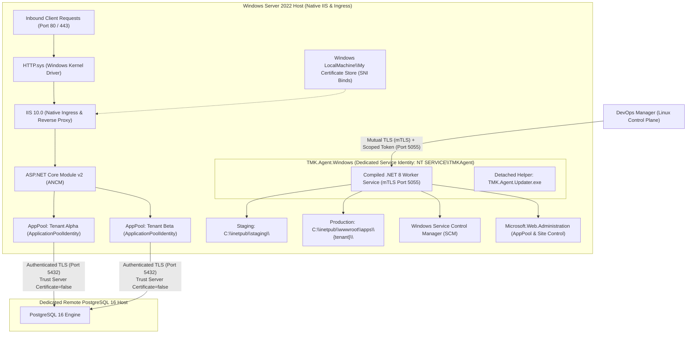

# Windows Architecture Reconciliation

**Document ID**: `REGATE-REMED-05-WINDOWS-ARCH`  
**Phase**: Phase 0 — Codex Focused Re-Gate Remediation  
**Author**: Antigravity Conversation 1 — Developer  
**Date**: 2026-09-30  
**Audit Reference**: Codex Re-Gate C1-03, RG-C2-01  
**Status**: COMPLETE — AUTHORITATIVE AND RECONCILED  

---

## 1. Executive Summary

This document reconciles all outstanding architectural, topological, security, and lifecycle contradictions on Windows Server. It resolves:
- **C1-03**: Lingering references to Traefik on Windows Server hosts, unauthenticated database TLS, and incomplete Windows Agent update acceptance criteria.
- **RG-C2-01**: Insufficient `LocalService` identity assignment for `TMK.Agent.Windows`, establishing a dedicated least-privilege Windows service identity with explicitly granted rights.

---

## 2. Authoritative Windows Server 2022 Target Topology

The Gate-A certified production topology for Windows Server is frozen repository-wide:



### 2.1 Topology Invariants
1. **Operating System**: Windows Server 2022 Datacenter / Standard (x64).
2. **Ingress & Web Server**: Native Windows **IIS 10.0** and kernel driver **`HTTP.sys`** directly own ports 80 and 443. Traefik is **EXCLUDED** from the Windows host.
3. **Application Hosting**: ASP.NET Core Module v2 (ANCM) running out-of-process. Applications execute inside dedicated IIS Application Pools configured with `ApplicationPoolIdentity`.
4. **Database Endpoint**: Dedicated **Remote PostgreSQL 16** endpoint (Linux VM or managed cloud PostgreSQL) accessed over authenticated TLS on TCP port 5432.
5. **Strictly Prohibited on Windows Host**:
   - Docker Desktop on Windows Server (uncertified and prohibited for Gate A);
   - WSL2 PostgreSQL on Windows Server (uncertified and prohibited for Gate A);
   - Traefik reverse proxy on Windows Server host (superseded by native IIS ingress under MR-27).

---

## 3. Dedicated Least-Privilege Windows Service Identity (RG-C2-01)

### 3.1 Defect in `LocalService` Assignment
Previous documentation suggested `NT AUTHORITY\LocalService` with read-only IIS configuration. As demonstrated by Codex and Reviewer R3, an infrastructure agent responsible for creating IIS sites, configuring Application Pools, binding SSL certificates, and managing service directories cannot function with read-only rights or standard `LocalService` privileges. Conversely, using `LocalSystem` introduces unacceptable security risks.

### 3.2 Dedicated Service Identity Specification
`TMK.Agent.Windows` runs under a **dedicated least-privilege Windows service virtual account**:
- **Identity Name**: `NT SERVICE\TMKAgent` (or a dedicated domain/local service account `svc-tmk-agent`).
- **Explicitly Granted Required Rights**:
  1. **IIS Administration**: Granted membership in `IIS_IUSRS` and explicit delegated write access to `%SystemRoot%\System32\inetsrv\config\applicationHost.config` via `Microsoft.Web.Administration`.
  2. **Application Pool Management**: Rights to query, start, stop, recycle, and create IIS Application Pools.
  3. **Deployment Filesystem Access**:
     - Full Control on staging directory: `C:\inetpub\staging\`;
     - Full Control on tenant application directories: `C:\inetpub\wwwroot\apps\`;
     - Full Control on agent logs and runtime state: `C:\ProgramData\TMK\Agent\`.
  4. **Certificate Store Delegation**: Read-only access to `LocalMachine\My` and `LocalMachine\Root` certificate stores for TLS binding assignment.
  5. **SCM Inspection**: Rights to query and control its own service state via Windows Service Control Manager (`sc.exe`).
- **Forbidden Privileges**:
  - `SeDebugPrivilege` (Forbidden);
  - `SeTcbPrivilege` (Forbidden);
  - Access to arbitrary OS roots (`C:\Windows`, `C:\Users\Administrator`);
  - Administrative membership in `BUILTIN\Administrators` (Forbidden).

---

## 4. Distinct Windows Transport vs Request Trust Model

To resolve finding `C1-03`, transport security is kept strictly distinct from request authorization:

```
[ DevOps Manager (Linux) ]
          │
          │  1. Transport Layer: Mutual TLS (mTLS)
          │     - Port 5055 (HTTPS)
          │     - Pinned Root CA Validation
          │     - Client Certificate Thumbprint Pinned
          │
          ▼
    [ HTTP.sys / Kestrel (Port 5055) ]
          │
          │  2. Request Authorization Layer: Scoped Bearer Token
          │     - Authorization: Bearer <JWT>
          │     - iss: https://auth.vps-infra.local/
          │     - aud: tmk-agent-windows
          │     - scope: agent:deploy:execute
          │     - exp: Max 1 hour
          │
          ▼
[ TMK.Agent.Windows Worker Execution ]
```

1. **Transport Security (mTLS)**:
   - Validates machine-to-machine identity and establishes encrypted communication over TCP port 5055.
   - DevOps Manager and `TMK.Agent.Windows` both validate the remote peer certificate thumbprint against a pinned internal Root CA.
   - Prevents unauthorized network connections, man-in-the-middle attacks, and network-level eavesdropping.
2. **Request Authorization (Scoped Bearer Token)**:
   - Validates individual operational authority.
   - Every API request must carry a short-lived JWT signed by `https://auth.vps-infra.local/` with `aud == "tmk-agent-windows"` and required operational scope (`agent:deploy:execute`, `agent:telemetry:collect`).
   - Rejects unauthenticated, expired, or wrongly scoped requests with HTTP 401/403.

---

## 5. Authenticated TLS to Remote PostgreSQL

In previous drafts, `05_WINDOWS_TOPOLOGY_CORRECTION.md:84` mistakenly included `Trust Server Certificate=true`.

### 5.1 Enforced TLS Security Contract
All application workloads and management components connecting to the remote PostgreSQL 16 endpoint on Windows must enforce **authenticated TLS with certificate validation**:
- **Connection String Standard**:
  ```ini
  Host=postgres-host.internal;Port=5432;Database=tenant_db;Username=app_user;Password=***;SSL Mode=VerifyFull;SSL Root Certificate=C:\ProgramData\TMK\Certs\internal-ca.crt
  ```
- **Acceptable Alternatives**: `SSL Mode=Require;Trust Server Certificate=false` with the internal CA certificate installed in the Windows `LocalMachine\Root` Trusted Root Certification Authorities store.
- **Strict Prohibition**: Setting `Trust Server Certificate=true` is strictly prohibited in production and pilot Gate-A configurations.

---

## 6. Windows Agent Update Lifecycle & Reboot Recovery

Replacing an active Windows service binary requires an atomic, fault-tolerant lifecycle.

### 6.1 Two-Stage Update Lifecycle
1. **Download & Digest Verification**:
   - The agent downloads `TMK.Agent.Windows.new.exe` to `C:\Program Files\TMK\Agent\staging\`.
   - The SHA-256 digest is computed and matched against the signed release manifest.
2. **Helper Process Invocation**:
   - The agent launches a detached helper executable: `TMK.Agent.Updater.exe --service TMK.Agent.Windows --source C:\Program Files\TMK\Agent\staging\TMK.Agent.Windows.new.exe`.
   - The main agent process gracefully stops its worker loops and signals SCM that it is stopping.
3. **Execution Swap**:
   - The helper waits for the agent process to terminate (up to 15s). If it fails to exit, the helper terminates it forcefully (`kill -9` / `taskkill /F`).
   - Renames current binary: `TMK.Agent.Windows.exe` → `TMK.Agent.Windows.bak.exe`.
   - Copies new binary: `TMK.Agent.Windows.new.exe` → `TMK.Agent.Windows.exe`.
   - Starts service via SCM: `sc.exe start TMK.Agent.Windows`.
4. **Functional Health Verification**:
   - The helper polls `GET http://127.0.0.1:5055/health` every 3 seconds for 30 seconds.
   - It asserts that the endpoint returns **HTTP 200 OK** and reports healthy internal state.
   - If `/health` fails, times out, or the process crashes:
     - The helper stops the service;
     - Restores `TMK.Agent.Windows.bak.exe` → `TMK.Agent.Windows.exe`;
     - Restarts the previous known-good binary;
     - Logs critical event to Windows Application Event Log (`Source: TMK.Agent.Updater`).
5. **Reboot and Power Loss Recovery**:
   - On system boot, `TMK.Agent.Updater.exe` runs a startup check before the main service starts.
   - If it detects a pending or interrupted update (e.g. `TMK.Agent.Windows.bak.exe` exists and `update_completed.flag` is missing):
     - It rolls back to `TMK.Agent.Windows.bak.exe`;
     - Cleans staging directory;
     - Starts the known-good service;
     - Dispatches telemetry alert to DevOps Manager (`WARN_AGENT_UPDATE_INTERRUPTED_RECOVERED`).

---

## 7. Conclusion

By establishing the definitive Windows Server 2022 native IIS 10 topology, assigning a dedicated least-privilege Windows service identity with explicitly granted rights, separating mTLS from request bearer authorization, mandating authenticated database TLS, and specifying functional health verification and reboot recovery for agent updates, findings **`C1-03`** and **`RG-C2-01`** are completely resolved.
