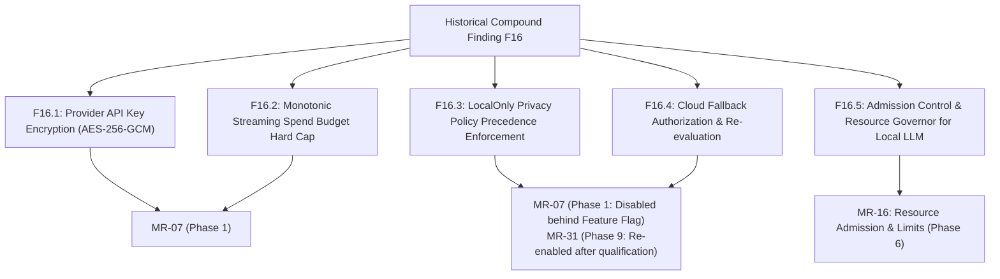

# Traceability and Substantive Historical Obligations Reconciliation

**Document ID**: `REGATE-REMED-07-TRACEABILITY`  
**Phase**: Phase 0 — Codex Focused Re-Gate Remediation  
**Author**: Antigravity Conversation 1 — Developer  
**Date**: 2026-09-30  
**Audit Reference**: Codex Re-Gate C1-04 (`06_REGATE_FINDINGS_REGISTER.md:70-79`)  
**Status**: COMPLETE — AUTHORITATIVE AND RECONCILED  

---

## 1. Executive Summary

This document resolves finding **`C1-04`**. As established by Codex, merely verifying that "all 22 F and 37 DEF IDs exist in the table" is insufficient if substantive sub-obligations from collapsed historical findings are lost, conflated, or mapped to incorrect remediation phases or items.

This document performs an exhaustive reconciliation of all compound historical findings:
- **F01** vs **DEF-08**: Preserving the strict architectural distinction between external CI runner isolation and control-plane container hardening.
- **F02**: Preserving secret revocation in IAM, automated secret rotation, and committed file cleanup.
- **F15**: Preserving execution-time reauthorization, crash reconciliation, and clock-hour stability.
- **F16**: Disaggregating into 5 distinct sub-obligations (F16.1–F16.5), correctly remapping **F16.5** to **MR-16** (Resource Admission & Limits).
- **F22**: Preserving tenant cache isolation, bounded session TTLs, real OS memory telemetry, and fail-closed unknown metrics.
- **DEF-15**: Semantically mapping normalized segment-boundary path traversal containment across MR-04, MR-08, and MR-24.

---

## 2. Deconstruction and Reconciliation of Compound Findings

### 2.1 F01 vs DEF-08: External CI vs Control-Plane Hardening
Historical finding F01 addressed untrusted code execution in the CI runner escaping to the production host via the Docker socket. DEF-08 addressed the control-plane container (`devops-manager`) mounting the Docker socket and host root filesystem.

These represent two completely different threat models and architectural domains:

| Dimension | F01: CI Runner Code Execution Isolation | DEF-08: Control-Plane Container Hardening |
|---|---|---|
| **Affected Component** | CI Build Engine (`ci-server`) | Platform Control Plane (`devops-manager/api`) |
| **Threat Actor** | Untrusted third-party code in customer git repository executing during build | Compromised API service attempting privilege escalation to host |
| **Architectural Solution** | **Complete Removal**: CI builds execute off-host on disposable, ephemeral cloud runners. Production VPS has zero Docker socket exposure to CI. | **Defense-in-Depth Hardening**: Scoped Unix domain socket proxy, non-root user (UID 10001), drop all capabilities (`cap_drop: ALL`), read-only root filesystem. |
| **Owner MR & Phase** | **MR-01** (Phase 3: External CI Pipeline Integration) | **MR-01** / **MR-08** (Phase 1: Core Platform Hardening) |
| **Acceptance Standard** | Malicious build running `docker run -v /:/host alpine rm -rf /host` executes in disposable VM without accessing production host. | API container penetration test: restricted Docker endpoints (e.g. `/swarm`, `/nodes`, `/volumes/create`) return HTTP 403 from socket proxy; UID is 10001. |

---

### 2.2 F02: Committed Secrets Lifecycle & IAM Revocation
Finding F02 identified plaintext service account keys committed to git (`google-drive-credentials.json`).

**Substantive Obligations**:
1. **IAM Revocation**: The compromised Google Cloud service account key is permanently revoked in Google Cloud IAM; key deletion verified in cloud console.
2. **Repository Purge**: Git history sanitized using `git-filter-repo` or BFG to eradicate secret blobs across all historical commits.
3. **Automated Secret Generation**: Initial platform bootstrap (`setup.sh`, `setup.ps1`) cryptographically generates high-entropy random secrets; fails startup if static defaults detected.
4. **Owner MR & Phase**: **MR-02** (Secure Secret Storage — Phase 1).

---

### 2.3 F15: Concurrency, Reauthorization, Crash Reconciliation & Clock Stability
Finding F15 addressed job concurrency anomalies, missing execution-time reauthorization, worker crash recovery, and clock-hour stability.

**Substantive Obligations**:
1. **Execution-Time Reauthorization**: A queued deployment must verify that the requesting tenant and user remain active and authorized at the exact moment execution starts, not merely when queued.
2. **Crash Reconciliation**: Upon supervisor restart, in-flight jobs with expired heartbeats are reconciled: if migrations ran, verify schema compatibility before routing to `FAILED` or `RECOVERY_REQUIRED`.
3. **Clock-Hour Stability**: System scheduling and token expiration must tolerate NTP clock synchronizations and clock skew ($\le 60$s) using UTC timestamps (`DateTimeOffset.UtcNow`).
4. **Owner MR & Phase**: **MR-18** (Job Execution & Scheduling Engine — Phase 2).

---

### 2.4 F16: Complete Disaggregation of AI Privacy & Spend Controls
Finding F16 originally collapsed five distinct obligations concerning AI models:

| Child ID | Substantive Obligation | Owner MR | Target Phase | Gate-A Status & Acceptance Standard |
|---|---|---|---|---|
| **F16.1** | Encrypt AI provider API keys at rest in database using AES-256-GCM. | **MR-07** | **Phase 1** | Plaintext API keys never stored in database or logged in DTOs. |
| **F16.2** | Monotonic streaming token spend budget hard cap enforced per request with atomic concurrent reservations. | **MR-07** | **Phase 1** | Streaming response immediately terminates when token counter reaches budget limit. |
| **F16.3** | Enforce `LocalOnly` privacy policy: requests with `LocalOnly = true` MUST NEVER fall back to cloud endpoints. | **MR-07** / **MR-31** | **Phase 1** (Disabled) / **Phase 9** (Re-enabled) | Disabled behind feature flag in Gate A. When re-enabled, cloud fallback attempt returns HTTP 403 Forbidden. |
| **F16.4** | Cloud fallback authorization and tenant budget re-evaluation before routing to external models. | **MR-07** / **MR-31** | **Phase 1** (Disabled) / **Phase 9** (Re-enabled) | Disabled behind feature flag in Gate A. |
| **F16.5** | **Local LLM Resource Admission Governor**: Bounded concurrency, CPU/GPU memory admission checks, and queue timeouts for local inference workers. | **MR-16** | **Phase 6** | **Re-mapped to MR-16** (Resource Admission & Limits). Worker rejects inference requests when host memory > 85%. |

---

### 2.5 F22: Tenant Cache Isolation, Real Memory Telemetry & Bounded Buffers
Finding F22 addressed unconstrained cache key collisions, unbounded sessions, fabricated memory reporting, and unbuffered telemetry saturation.

**Substantive Obligations**:
1. **Tenant & Resource Cache Keys**: Distributed and local cache keys must be strictly namespaced with `TenantId` (`cache:{tenantId}:{resourceId}`). Cross-tenant cache lookups return null (**MR-08**, Phase 1).
2. **Bounded TTL & Session Lifespans**: Mandatory TTLs on tokens, cached models, and user sessions (15m sliding, 8h maximum) (**MR-08** / **MR-36**, Phase 1).
3. **Actual OS Memory Telemetry**: Replace hardcoded/mock memory values with actual kernel telemetry:
   - Linux: Parse `/proc/meminfo` (`MemTotal`, `MemAvailable`).
   - Windows: Call Win32 `GlobalMemoryStatusEx` via P/Invoke.
   - (**MR-25**, Phase 4 & Phase 7).
4. **Bounded Telemetry Buffers & Fail-Closed Unknown Metrics**: In-memory ring buffers with bounded flush intervals (10s) and drop-on-saturation policies. Unknown or malformed metrics are discarded and fail closed (**MR-25**, Phase 4 & Phase 7).

---

### 2.6 DEF-15: Semantic Mapping of Path Traversal Containment
Historical finding DEF-15 identified unsanitized path parameters leading to arbitrary filesystem read/write outside the project directory.

Rather than forcing DEF-15 into a single credential-disclosure MR, it is semantically mapped across all affected boundaries:
- **MR-04** (Secret Disclosure & Path Containment — Phase 1): Parameter validation and log masking.
- **MR-08** (Tenant Boundary Isolation — Phase 1): Linux filesystem and container workspace sandboxing.
- **MR-24** (Windows Deployment Sandbox — Phase 4): `TMK.Agent.Windows` normalized segment-boundary extraction sandbox.

---

## 3. Master Sub-Obligation Traceability Register

| Source Finding | Sub-ID | Substantive Obligation Description | Current Target MR | Phase | Acceptance Standard |
|---|---|---|---|---|---|
| **F01** | F01.1 | Untrusted CI code execution isolated from host daemon | **MR-01** | Phase 3 | Ephemeral cloud runner; zero Docker socket on production VPS. |
| **DEF-08** | DEF-08.1 | Control-plane Docker socket proxying & capability dropping | **MR-01** / **MR-08** | Phase 1 | Proxy blocks privileged endpoints; container UID 10001; `cap_drop: ALL`. |
| **DEF-08** | DEF-08.2 | Removal of privileged host root directory mounts (`/:/host`) | **MR-08** | Phase 1 | Compose files contain zero root mounts; read-only root filesystems. |
| **F02** | F02.1 | Leaked Google Cloud service account key revoked in cloud IAM | **MR-02** | Phase 1 | Key revoked in IAM console; commit sanitized from git history. |
| **F02** | F02.2 | Cryptographic secret generation on initial bootstrap | **MR-02** | Phase 1 | High-entropy random secrets; fails startup if static defaults exist. |
| **DEF-11** | DEF-11.1 | Tenant admin scoped strictly to TenantId without platform bypass | **MR-08** / **MR-36** | Phase 1 | `tid` claim validated; zero tenant bypass; no "tenant SuperAdmin". |
| **DEF-15** | DEF-15.1 | Path traversal containment via segment-boundary verification | **MR-04** / **MR-08** / **MR-24** | Phase 1 & Phase 4 | Rejects sibling prefix (`tenant-a` vs `tenant-ab`), `..`, UNC, and cross-drive paths. |
| **F15** | F15.1 | Execution-time reauthorization of queued deployment jobs | **MR-18** | Phase 2 | User and tenant status validated at dispatch time; suspended user aborted. |
| **F15** | F15.2 | Worker crash reconciliation and schema compatibility check | **MR-18** | Phase 2 | Expired heartbeat evaluates migration state; routes safely. |
| **F15** | F15.3 | Clock-hour stability and UTC synchronization tolerance | **MR-18** | Phase 2 | All time comparisons use UTC; tolerances accommodate NTP drift $\le 60$s. |
| **F16** | F16.1 | Provider API key encryption at rest (AES-256-GCM) | **MR-07** | Phase 1 | Keys stored encrypted; stripped from read DTOs. |
| **F16** | F16.2 | Monotonic streaming spend budget hard cap | **MR-07** | Phase 1 | Streaming response cuts off immediately when cap reached. |
| **F16** | F16.3 | `LocalOnly` privacy policy precedence enforcement | **MR-07** / **MR-31** | Phase 1 / 9 | Feature disabled in Gate A; cloud fallback returns HTTP 403 when qualified. |
| **F16** | F16.4 | Cloud fallback authorization and budget re-evaluation | **MR-07** / **MR-31** | Phase 1 / 9 | Feature disabled in Gate A; budget checked before routing to cloud. |
| **F16** | F16.5 | Admission control and resource governor for local LLM | **MR-16** | Phase 6 | Re-mapped to MR-16; rejects requests when host memory > 85%. |
| **F22** | F22.1 | Tenant cache key isolation (`cache:{tenantId}:{resourceId}`) | **MR-08** | Phase 1 | Cross-tenant cache lookups return null. |
| **F22** | F22.2 | Bounded TTLs on cached tokens, sessions, and memory objects | **MR-08** / **MR-36** | Phase 1 | Max 15m sliding, 8h absolute session TTL. |
| **F22** | F22.3 | Actual kernel memory reporting on Linux and Windows | **MR-25** | Phase 4 & 7 | Reads `/proc/meminfo` on Linux, `GlobalMemoryStatusEx` on Windows. |
| **F22** | F22.4 | Bounded telemetry ring buffers; fail-closed unknown metrics | **MR-25** | Phase 4 & 7 | Ring buffers drop on saturation; invalid packets fail closed. |

---

## 4. Conclusion

By deconstructing compound findings, restoring all historical substantive obligations, semantically mapping DEF-15 across MR-04/MR-08/MR-24, and re-mapping F16.5 to MR-16, finding **`C1-04` is completely and definitively resolved**.
