# 03 RELEASE SAFETY AND DATABASE RECOVERY CONTRACT REVIEW

**Document ID**: `REMED-R4-03`  
**Phase**: Phase 0 — Current-State Reconciliation & Architecture Freeze  
**Review Cycle**: R4 (Final Independent Review of Codex Re-Gate Remediation)  
**Author**: Antigravity Conversation 2 — Independent Reviewer  
**Status**: Authoritative Architectural Audit Complete  
**Date**: 2026-09-30  

---

## 1. Database Restore Blocker Review (Codex C0-01)

### 1.1 Audit Context & Historical Flaw
In earlier iterations of the Phase 0 documentation, deployment and upgrade recovery procedures contained a critical safety hazard: on application health check failure after cutover or during upgrade, the system attempted to automatically restore a pre-deployment database backup. 

As Codex correctly identified in finding `C0-01`, this practice is catastrophic in production: restoring an earlier database dump wipes out all customer writes committed between the backup snapshot and the failure event, causing irrecoverable data loss.

### 1.2 Independent Text Verification Across Baseline
The Independent Reviewer performed an exhaustive search across the entire authoritative Phase 0 baseline (`docs/remediation/phase-0/`) for semantic equivalents of:
- automatic database restore
- restore pre-upgrade backup
- restore DB after health failure
- DB rollback on deployment failure
- database restore as application rollback

**Audit Findings**:
1. In [`12_UPGRADE_CURRENT_STATE.md`](file:///d:/company/products/vps-infra/vps-infra-server/docs/remediation/phase-0/12_UPGRADE_CURRENT_STATE.md#L127), the stale instruction on line 125 that previously mandated automatic database restoration has been completely removed and replaced with:
   > `CRITICAL INVARIANT: Application rollback MUST NOT automatically restore the database. The previous release must remain compatible with the database schema under the Expand/Contract contract. Destructive database restoration is strictly an explicit disaster recovery operation requiring human authorization (--confirm-destructive-data-loss), system quiescing, an ad-hoc pre-restore safety dump, and data-loss window assessment.`
2. In [`07_DEPLOYMENT_SAFETY_CONTRACT.md`](file:///d:/company/products/vps-infra/vps-infra-server/docs/remediation/phase-0/07_DEPLOYMENT_SAFETY_CONTRACT.md#L174-L179), Section 5.1 freezes the universal invariant:
   > **`APPLICATION ROLLBACK MUST NOT AUTOMATICALLY RESTORE THE DATABASE.`**
3. In [`09_BACKUP_RECOVERY_CONTRACT.md`](file:///d:/company/products/vps-infra/vps-infra-server/docs/remediation/phase-0/09_BACKUP_RECOVERY_CONTRACT.md#L109-L115), Section 5 explicitly codifies the Pre-Restore Safety Contract, mandating `--confirm-destructive-data-loss`, application quiescing, and an ad-hoc pre-restore safety dump before any database restore can occur.

**Reviewer Verdict**: **PASS**. The prohibited behavior is completely eradicated from all authoritative baseline documents.

---

## 2. Separation of Architectural Concerns

The authoritative architecture now strictly disentangles three previously conflated concerns:

```mermaid
graph TD
    subgraph Layer 1: Application Rollback
        AR[Application Rollback] --> |Non-Destructive| Repoint[Re-point Router / Ingress to Standby Release N-1]
        Repoint --> TermStaging[Prune Staging Container / AppPool]
    end

    subgraph Layer 2: Schema Compatibility
        EC[Expand / Contract Policy] --> Additive[Additive Changes Only in Release N]
        Additive --> DualWrite[Dual-write & Read Compatibility]
        DualWrite --> N1Compatible[Release N-1 Remains 100% Operational]
    end

    subgraph Layer 3: Disaster Recovery
        DR[Database Restoration] --> |Destructive| HumanAuth[Operator Authorization: --confirm-destructive-data-loss]
        HumanAuth --> Quiesce[Quiesce Application / Enter Maintenance Mode]
        Quiesce --> SafetyDump[Execute Ad-Hoc Pre-Restore Safety Dump]
        SafetyDump --> RestoreDrill[Restore Data Under Forensic Supervision]
    end
```

1. **Application Rollback**: Safe, automated, and non-destructive. Only container instances, AppPool bindings, and ingress routing tables (Traefik dynamic YAML / IIS bindings) are reverted to point back to the proven standby release ($N-1$).
2. **Schema Compatibility**: Controlled by the Expand/Contract migration contract. Database migrations must remain backward-compatible with Release $N-1$ so that application rollback does not require any database modification.
3. **Disaster Recovery**: Destructive, human-authorized, and decoupled from release automation. Invoked only when physical database corruption or data loss occurs, completely isolated from ordinary deployment failure handling.

---

## 3. Documentary Walkthrough of 10 Release Failure Scenarios

The Reviewer independently verified the 10 failure walkthrough scenarios documented in [`07_DEPLOYMENT_SAFETY_CONTRACT.md`](file:///d:/company/products/vps-infra/vps-infra-server/docs/remediation/phase-0/07_DEPLOYMENT_SAFETY_CONTRACT.md) and [`02_RELEASE_AND_DATABASE_RECOVERY_RECONCILIATION.md`](file:///d:/company/products/vps-infra/vps-infra-server/docs/remediation/phase-0-codex-regate-remediation/02_RELEASE_AND_DATABASE_RECOVERY_RECONCILIATION.md):

| # | Scenario | Active State | Trigger / Failure Mode | State Machine & Supervisor Action | Terminal Safe State | Automated DB Restore? | Data Loss? |
|---|---|---|---|---|:---:|:---:|:---:|
| **1** | **Duplicate Request** | `APPLYING` | Concurrent deployment submission with identical `IdempotencyKey`. | Middleware intercepts request; matches active key in PostgreSQL; returns HTTP 409 Conflict with active status URL. Zero new containers or locks created. | `APPLYING` (Unchanged) | **NO** | Zero |
| **2** | **Lock-Holder Death** | `APPLYING` | Worker process killed (OOM / host crash) during file extraction or container startup. | Heartbeat TTL (60s) expires. Supervisor detects dead `WorkerPid`, cleans up staging directory, verifies no migrations ran, releases advisory lock. | `FAILED` | **NO** | Zero |
| **3** | **Crash Before Mutation** | `PRECHECK` / `PREPARED` | VM power loss or node reboot during artifact pull or dependency preflight. | Recovery scanner on reboot detects expired heartbeat in `PRECHECK`. Zero physical or database mutations occurred. Releases advisory lock. | `FAILED` | **NO** | Zero |
| **4** | **Crash After Mutation Before State Write** | `APPLYING` | Staging container spawned or migration applied, host crashes before state write. | Recovery scanner inspects `__EFMigrationsHistory` and container state. If migration ran, evaluates compatibility with $N-1$. If compatible, cleans staging and marks `FAILED`; if incompatible or uncertain, transitions to `RECOVERY_REQUIRED`. | `FAILED` or `RECOVERY_REQUIRED` | **NO** | Zero |
| **5** | **Staging Verification Failure** | `VERIFYING` | Staging container fails internal health probe (`/health` returns HTTP 500 three times). | Release engine halts progress. Traffic was never cut over (ingress still points 100% to $N-1$). Staging container stopped and pruned. Advisory lock released. | `FAILED` | **NO** | Zero |
| **6** | **Cutover Failure** | `CUTOVER` | Traefik dynamic YAML syntax error or IIS HTTP.sys URL reservation binding fails. | Cutover transaction aborts. Ingress router verified to route 100% of traffic to previous container ($N-1$). Engine initiates `ROLLBACK`. Staging stopped. | `ROLLED_BACK` | **NO** | Zero |
| **7** | **Post-Cutover Failure** | `POST_CUTOVER_VERIFY` | 5xx error rate exceeds 1% during 30s live observation window. | Automated application rollback triggered. Ingress router immediately redirects traffic back to standby container ($N-1$). Staging container stopped. Database snapshot is NOT restored. All customer writes committed during observation window are preserved in DB. | `ROLLED_BACK` | **NO** | Zero |
| **8** | **Incompatible Migration** | `PRECHECK` | Candidate release contains destructive migration (e.g. dropping column required by $N-1$). | Pre-deployment migration analyzer detects destructive migration without explicit `--allow-irreversible-migration` flag. Deployment rejected before execution. | `FAILED` | **NO** | Zero |
| **9** | **App Failure After Compatible Migration** | `APPLYING` / `VERIFYING` | Additive migration succeeds, but new application code throws runtime configuration exception on startup. | Staging health checks fail. System initiates application rollback: router remains on $N-1$. Staging container stopped. Database is NOT restored because $N-1$ is fully compatible with additive schema. | `ROLLED_BACK` | **NO** | Zero |
| **10** | **Writes Occurring After Pre-Deploy Backup** | `POST_CUTOVER_VERIFY` | Users make purchases or update records after pre-deploy backup was taken. Health subsequently fails. | Application rollback reverts container image and traffic to $N-1$. Database is NOT restored. Post-deploy writes remain safely in database. Operator investigates application logs. | `ROLLED_BACK` | **NO** | Zero |

**Reviewer Trace Analysis**: Every one of the 10 failure paths terminates in a deterministic, observable safe state. No path leaves orphaned mutations or triggers unverified promotions.

---

## 4. Worker Fencing and Mutation Protection

To prevent split-brain conditions or late writes when a partitioned or paused worker resumes execution after its heartbeat has expired:

1. **Database Fencing (Optimistic Concurrency CAS)**: Every state update checks `Version = @ExpectedVersion` and atomically increments `Version`. Stale worker updates fail immediately with `DbUpdateConcurrencyException`.
2. **Physical Process Fencing (PID Termination)**: When a recovering supervisor takes over an expired deployment, it must verify the prior `WorkerPid` and issue a forceful termination signal (`kill -9` on Linux, `TerminateProcess` on Windows) before altering staging directories or router configurations.
3. **Deployment Generation Epoch Tokens**: Staging directories and router configurations incorporate generation tokens (e.g. `release-{deployId}-{generation}`). Stale workers writing to obsolete generation roots cannot alter active ingress symlinks or IIS virtual directories.

**Governance Verification**: The Reviewer confirms that these mechanisms are documented strictly as **Phase 2 architectural requirements**, and are NOT falsely claimed as already implemented in current source code.

---

## 5. Expand / Contract Schema Evolution Model

The compatibility model across active rollback candidates is formally structured across three release generations:

1. **Release $N$ (Expand Phase)**:
   - Schema mutations must be strictly additive (adding nullable columns, new tables, views, concurrent indexes).
   - Single-step column renames, drops, and non-nullable additions without defaults are strictly prohibited.
   - Dual-writing is implemented if new columns replace legacy fields.
   - Rollback candidate: Release $N-1$ remains 100% operational against the Release $N$ expanded schema.
2. **Release $N+1$ (Transition Phase)**:
   - Application code reads and writes exclusively to the new schema elements.
   - **Crucial Rule**: Release $N+1$ **MUST NOT** drop the legacy columns, because if Release $N+1$ rolls back to Release $N$, Release $N$ still requires those columns for dual-writing.
3. **Release $N+2$ (Contract Finalize Phase)**:
   - Only after Release $N+1$ is fully accepted in production, and Release $N$ is no longer an active rollback target, the legacy columns may be safely dropped.
   - If an irreversible migration is explicitly approved via `--allow-irreversible-migration`, the release engine invalidates earlier releases as automated rollback targets and requires operator confirmation.

**Governance Verification**: The Reviewer confirms that this Expand/Contract policy is correctly established as the required migration contract for Phase 2 implementation.

---

## 6. Reviewer Domain Verdict

- **Database Restore Invariant**: **PASS** (Zero automatic database restores permitted).
- **Failure Walkthrough Determinism**: **PASS** (All 10 scenarios terminate safely).
- **Fencing & Epoch Framing**: **PASS** (Correctly categorized as Phase 2 requirements).
- **Expand/Contract Policy**: **PASS** (Coherent multi-release compatibility contract).
