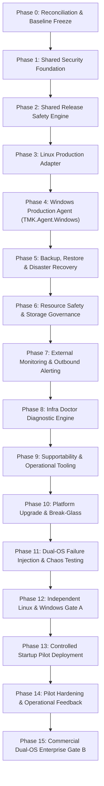

# 13 PHASEWISE REMEDIATION ROADMAP INDEPENDENT REVIEW

**Document ID**: `REMED-P0-REV-13`  
**Phase**: Phase 0 — Independent Review & Acceptance  
**Reviewer**: Antigravity Conversation 2 — Independent Reviewer  
**Date**: 2026-09-29  

---

## 1. Phasewise Roadmap Sequencing Review (Phases 0 — 15)

The Reviewer audited the 16-phase remediation sequence set forth in [`16_PHASEWISE_REMEDIATION_PLAN.md`](file:///d:/company/products/vps-infra/vps-infra-server/docs/remediation/phase-0/16_PHASEWISE_REMEDIATION_PLAN.md):

---

## 2. Dependency & Architectural Soundness Evaluation

### 2.1 Foundational Sequencing (Phases 0 — 2): **SOUND**
- Establishing security boundaries (Phase 1: identity, secret generation, tenant scoping) and release durability (Phase 2: state machine, immutable digests, rollback) before building OS adapters is the correct engineering sequence. Adapters must bind to stable platform interfaces.

### 2.2 Parallel OS Adapter Construction (Phases 3 & 4): **SOUND & COMPLIANT**
- Phase 3 (Linux Adapter) and Phase 4 (Windows Agent & IIS Adapter) are positioned with equal first-class priority.
- Windows remediation is NOT deferred to post-pilot. Developing the compiled `TMK.Agent.Windows` service in Phase 4 ensures Windows is ready for dual-OS chaos testing in Phase 11.

### 2.3 Operational Reliability (Phases 5 — 7): **SOUND**
- Placing Backup/DR (Phase 5), Resource Controls (Phase 6), and Outbound Alerting (Phase 7) immediately after adapter stabilization ensures core operational resilience before exposing the platform to operator tooling.

### 2.4 Supportability & Upgrades (Phases 8 — 10): **SOUND**
- Developing Infra Doctor (Phase 8), sanitized support bundles (Phase 9), and safe platform upgrades with break-glass export (Phase 10) completes the administrative operational lifecycle.

### 2.5 Verification & Pilot Gating (Phases 11 — 15): **RIGOROUS**
- **Phase 11 (Dual-OS Failure Injection)**: Mandates automated chaos testing on **BOTH Linux and Windows Server** (crashing containers/AppPools, network drops, corrupted backups) before any customer pilot.
- **Phase 12 (Independent Gate A)**: Evaluates Linux Gate A and Windows Gate A independently.
- **Phase 13 (Pilot)**: Permits Linux to start an operational pilot earlier if it reaches Gate A first, while Windows actively completes certification.
- **Phase 15 (Commercial Gate B)**: Mandates dual-OS certification before general commercial release.

---

## 3. Scope Boundary Discipline (Anti-Bloat Check)

The Reviewer explicitly evaluated whether the Developer introduced unnecessary architectural bloat:
- **Kubernetes / Service Mesh**: **EXCLUDED**. The roadmap correctly commits to single-VM Docker Compose on Linux and native IIS on Windows.
- **Distributed Tracing (OpenTelemetry/Jaeger)**: **EXCLUDED**. Structured Serilog logs and local performance counters are maintained.
- **Multi-Node High Availability (HA)**: **EXCLUDED**. The scope remains disciplined single-VM hosting with robust offsite disaster recovery.
- **Autonomous Destructive AI**: **EXCLUDED**. Core platform reliability is 100% deterministic and decoupled from experimental LLMs.

**Conclusion**: The phasewise plan is disciplined, technically coherent, and enforces strict dual-OS parity without unnecessary complexity.
