# 04 TARGET ARCHITECTURE SPECIFICATION & FREEZE

**Document ID**: `REMED-P0-04`  
**Phase**: Phase 0 — Current-State Reconciliation & Architecture Freeze  
**Author**: Antigravity Conversation 1 — Developer  
**Status**: Target Architecture Frozen for Implementation Phases  
**Review Status**: PENDING INDEPENDENT REVIEW & CODEX AUDIT GATE  

---

## 1. Architectural Strategy & Modular Boundary

To ensure enterprise stability, security isolation, and true cross-platform parity, the target platform architecture cleanly decouples the **Shared Platform Core** from OS-specific runtime adapters:

```mermaid
graph TD
    subgraph "Control Plane (Shared Platform Core)"
        Core["Shared Platform Core (.NET / Web / CI)"]
        Auth["Identity & RBAC"]
        Sec["Encrypted Secret Store"]
        SM["Deployment State Machine"]
        Rel["Immutable Release Engine"]
        Gov["Resource Governor"]
        DR["Backup & Disaster Recovery"]
        Obs["Telemetry, Alerting & Audit"]
        
        Core --> Auth & Sec & SM & Rel & Gov & DR & Obs
    end

    subgraph "Linux Production Adapter"
        L_Adapter["Linux Host Adapter"]
        Docker["Docker Engine & Compose"]
        Traefik["Traefik Reverse Proxy & TLS"]
        L_Net["Linux Bridge / UFW Firewall"]
        L_Vol["Linux Storage & Bind Mounts"]
        L_Mon["cgroup & Container Telemetry"]
        
        L_Adapter --> Docker & Traefik & L_Net & L_Vol & L_Mon
    end

    subgraph "Windows Production Adapter"
        W_Adapter["TMK.Agent.Windows (Compiled .NET Worker)"]
        SCM["Windows Service Control Manager (SCM)"]
        IIS["IIS WebAdministration / AppPools"]
        Cert["Windows Certificate Store / TLS"]
        NTFS["NTFS ACLs & Sandboxed Dirs"]
        W_Mon["WMI / AppPool Telemetry"]
        
        W_Adapter --> SCM & IIS & Cert & NTFS & W_Mon
    end

    Core -- "gRPC / Authenticated TLS" --> L_Adapter
    Core -- "Mutual TLS / Token Auth" --> W_Adapter
```

---

## 2. Shared Platform Core

The Shared Platform Core executes platform-level business logic independently of the underlying operating system:

1. **Identity / RBAC**:
   - Multi-tenant principal context injected into every request.
   - Resource-scoped authorization (TenantId + ProjectId + ServiceId).
   - Strict separation of `PlatformSuperAdmin` (global host/infrastructure management only, zero customer data access) from `TenantAdmin` (customer administration scoped strictly to `TenantId`). No "tenant SuperAdmin" global bypass.

2. **Secrets & Cryptographic Key Management**:
   - Zero committed plaintext secrets or fallback keys.
   - Per-installation encrypted secret vault using OS DPAPI or AES-256-GCM.
   - In-memory redaction of secrets in log templates, process arguments, and trace outputs.
   - Comprehensive Token Trust Contract (`iss`, `aud`, `sub`, `tid`, algorithm, lifetime, rotation, revocation).

3. **Release Model & Artifact Provenance**:
   - Mandatory immutable release identifiers (SemVer + Git SHA or Content Digest).
   - Strict prohibition of mutable branches (`main`, `master`, `latest`) as release targets.
   - Cryptographic signature or SHA-256 checksum verification before deployment execution.

4. **Deployment State Machine**:
   - Durable, transactionally persisted lifecycle transitions:
     `PENDING` → `PRECHECK` → `PREPARED` → `APPLYING` → `VERIFYING` → `CUTOVER` → `POST_CUTOVER_VERIFY` → `SUCCEEDED`
   - Explicit failure states:
     `FAILED` (pre-mutation) or `ROLLBACK` → `ROLLED_BACK` / `RECOVERY_REQUIRED`
   - Single-host per-service atomic locking via PostgreSQL advisory locks and idempotency keys.
   - Process crash / server reboot recovery: deterministic reconciliation of in-flight states upon startup without premature promotion.

5. **Health & Readiness Contract**:
   - Multi-probe verification: Liveness (is process running?), Staging Readiness (is staging endpoint healthy on `/health` for 3 consecutive probes over 15s?), and Post-Cutover Public Stability Window (30s observation with 5xx < 1%).
   - Deployment success (`SUCCEEDED`) gated strictly on passing post-cutover verification and live serving proof.

6. **Rollback & Database Compatibility Contract**:
   - Deterministic automated rollback to verified preceding immutable release standby instance.
   - Strict decoupling: Application rollback (reverting traffic routing) does NOT trigger automatic database restoration.
   - Schema migrations follow Expand/Contract pattern so that Release $N-1$ remains compatible with Release $N$ schema.
   - Destructive database restoration is an explicit disaster recovery operation requiring human authorization and safety dumps.

7. **Migration & Schema Contract**:
   - Single authoritative schema manager: Versioned EF Core Migrations.
   - Zero competing raw `ALTER TABLE` DDL in `DataSeeder.cs`; seeder bounded purely to initial data population; raw DDL removal milestone in Phase 2 (MR-13).
   - Forward and backward schema compatibility checks prior to deployment.

8. **Backup & Disaster Recovery Contract**:
   - 7-stage pipeline: `Capture` → `Format-Aware Verify` (`pg_restore --list`) → `Client-Side Encrypt` (AES-256-GCM) → `Offsite Dispatch` → `Remote Digest Verify` → `Catalog Recovery Point` → `Retain/Expire`.
   - Offsite key escrow via BIP-39 recovery passphrase surviving total host loss.
   - Measurable targets: RPO 24h (scheduled) / 1h (pre-deploy); RTO 30 min.

9. **Resource Governance**:
   - Capacity admission check before initiating resource-heavy operations (builds, deployments, backups).
   - Bounded task queues with cgroup / process-level CPU, memory, and PID limits.
   - Guaranteed resource reserve for core infrastructure databases.

10. **Monitoring, Alerting, Audit & Diagnostics**:
    - Multi-channel outbound alerting (SMTP Email, Slack, generic Webhook).
    - Redacted 1-click diagnostic support bundle export for operator troubleshooting.
    - Tenant-scoped audit logs with 30-day retention policies.

---

## 3. Linux Production Adapter

The Linux Adapter implements runtime deployment and infrastructure controls on Linux hosts:

1. **Docker Engine & Compose Runtime**:
   - Managed Docker Compose lifecycle for application containers.
   - AST-based YAML mutation ensuring strict service isolation (no regex contamination).
   - Graceful container stopping (`SIGTERM` with 30s timeout before `SIGKILL`).

2. **Traefik Ingress & TLS Management**:
   - Dynamic Docker provider routing with automated Let's Encrypt TLS certificates.
   - Pre-flight DNS validation preventing ACME rate-limit exhaustion.
   - Strict internal network routing (`traefik_net`) isolating databases from the public internet.

3. **Linux Networking & Host Firewall**:
   - Database manifests bind strictly to `127.0.0.1` or internal Docker networks.
   - Docker-aware iptables configuration preventing UFW bypass.
   - Rate limiting and connection quotas on exposed entrypoints.

4. **Linux Storage & Bind Mounts**:
   - Structured volume directories: `/var/www/vps-infra/volumes/{service}/`.
   - Immutable artifact cache preserving minimum 3 previous release images for instantaneous rollback.
   - Scheduled non-destructive disk cleanup preserving active rollback sets.

5. **Linux Telemetry**:
   - Native cgroup v2 memory and CPU metric extraction per container.
   - Real-time Docker event streaming for container failure alerting.

---

## 4. Windows Production Adapter

The Windows Adapter replaces historical PowerShell scripts with a robust, compiled daemon:

1. **Compiled .NET Worker / Windows Service (`TMK.Agent.Windows`)**:
   - Replaces `tmk-iis-agent.ps1` as the production long-running IIS deployment daemon.
   - Native integration with Windows Service Control Manager (SCM), eliminating Error 1053.
   - Runs as `NT AUTHORITY\LocalService` with restricted filesystem ACLs.
   - PowerShell retained exclusively for one-time host bootstrap and prerequisites setup.

2. **IIS Management via Microsoft.Web.Administration**:
   - Native in-process C# management of IIS Sites, Application Pools, and Virtual Directories.
   - Automated `app_offline.htm` request draining during deployment extraction.
   - Recycling and warmup probe execution with strict timeout controls.

3. **Windows Ingress, Certificates & Port Sharing (Zero Conflict)**:
   - Traefik is **NOT deployed** on the Windows host.
   - Native Windows `HTTP.sys` driver and IIS 10 own ports 80 and 443 directly.
   - Native Windows Certificate Store integration (`LocalMachine\My`) for SNI SSL/TLS bindings.
   - Elimination of `setup.ps1` W3SVC stop command; IIS runs continuously.

4. **Certified Windows Gate-A Database Topology**:
   - Application workloads on Windows IIS connect to a **Remote PostgreSQL 16 Endpoint** (dedicated Linux VM or managed PostgreSQL service) over TLS port 5432.
   - WSL2 and Docker Desktop on Windows Server are explicitly uncertified and prohibited for Gate A.

5. **Constrained Deployment Filesystem Sandbox**:
   - Enforced target root (e.g. `C:\inetpub\wwwroot\apps\{AppName}\releases\{ReleaseId}`).
   - Path normalization and directory traversal prevention (`Path.GetFullPath` prefix validation).
   - Windows NTFS ACL enforcement: Application Pool identities granted least-privilege permissions.

6. **Windows Telemetry & Concurrency**:
   - Asynchronous multi-threaded HTTP/API binding on port 5055 with mTLS authentication.
   - Exact per-AppPool memory accounting via worker process PID tracking (eliminating the all-w3wp summation defect).
   - Atomic agent self-update wrapper (`TMK.Agent.Updater.exe`) with automatic rollback on service start failure.
