# 04 TARGET ARCHITECTURE SPECIFICATION & FREEZE

**Document ID**: `REMED-P0-04`  
**Phase**: Phase 0 — Current-State Reconciliation & Architecture Freeze  
**Author**: Antigravity Conversation 1 — Developer  
**Status**: Target Architecture Frozen for Implementation Phases  
**Review Status**: PENDING INDEPENDENT REVIEW & CODEX AUDIT GATE  

---

## 1. Architectural Strategy & Modular Boundary

To ensure enterprise stability, security isolation, and true cross-platform parity, the target platform architecture cleanly decouples the **Shared Platform Core** from OS-specific runtime adapters:

```mermaid
graph TD
    subgraph "Control Plane (Shared Platform Core)"
        Core["Shared Platform Core (.NET / Web / CI)"]
        Auth["Identity & RBAC"]
        Sec["Encrypted Secret Store"]
        SM["Deployment State Machine"]
        Rel["Immutable Release Engine"]
        Gov["Resource Governor"]
        DR["Backup & Disaster Recovery"]
        Obs["Telemetry, Alerting & Audit"]
        
        Core --> Auth & Sec & SM & Rel & Gov & DR & Obs
    end

    subgraph "Linux Production Adapter"
        L_Adapter["Linux Host Adapter"]
        Docker["Docker Engine & Compose"]
        Traefik["Traefik Reverse Proxy & TLS"]
        L_Net["Linux Bridge / UFW Firewall"]
        L_Vol["Linux Storage & Bind Mounts"]
        L_Mon["cgroup & Container Telemetry"]
        
        L_Adapter --> Docker & Traefik & L_Net & L_Vol & L_Mon
    end

    subgraph "Windows Production Adapter"
        W_Adapter["TMK.Agent.Windows (Compiled .NET Worker)"]
        SCM["Windows Service Control Manager (SCM)"]
        IIS["IIS WebAdministration / AppPools"]
        Cert["Windows Certificate Store / TLS"]
        NTFS["NTFS ACLs & Sandboxed Dirs"]
        W_Mon["WMI / AppPool Telemetry"]
        
        W_Adapter --> SCM & IIS & Cert & NTFS & W_Mon
    end

    Core -- "gRPC / Authenticated TLS" --> L_Adapter
    Core -- "Mutual TLS / Token Auth" --> W_Adapter
```

---

## 2. Shared Platform Core

The Shared Platform Core executes platform-level business logic independently of the underlying operating system:

1. **Identity / RBAC**:
   - Multi-tenant principal context injected into every request.
   - Resource-scoped authorization (TenantId + ProjectId + ServiceId).
   - Strict separation of platform SuperAdmin from tenant roles (`Manager`, `Developer`, `Viewer`).

2. **Secrets & Cryptographic Key Management**:
   - Zero committed plaintext secrets or fallback keys.
   - Per-installation encrypted secret vault using OS DPAPI or AES-256-GCM.
   - In-memory redaction of secrets in log templates, process arguments, and trace outputs.

3. **Release Model & Artifact Provenance**:
   - Mandatory immutable release identifiers (SemVer + Git SHA or Content Digest).
   - Strict prohibition of mutable branches (`main`, `master`, `latest`) as release targets.
   - Cryptographic signature or SHA-256 checksum verification before deployment execution.

4. **Deployment State Machine**:
   - Durable, transactionally persisted lifecycle transitions:
     `PRECHECK` → `PREPARED` → `APPLYING` → `VERIFYING` → `SUCCEEDED`
   - Explicit failure states:
     `FAILED` → `ROLLBACK` → `ROLLED_BACK` or `RECOVERY_REQUIRED`
   - Process crash / server reboot recovery: automatic reconciliation of in-flight states upon startup.

5. **Health & Readiness Contract**:
   - Dual-probe verification: Liveness (is process running?) and Readiness (is HTTP endpoint serving traffic?).
   - Configurable timeout, retry count, and expected status codes (e.g. HTTP 200).
   - Deployment success gated strictly on passing readiness verification.

6. **Rollback Contract**:
   - Zero-downtime rollback to verified preceding immutable release digest or package.
   - Pre-deployment automated safety snapshot of affected databases and configuration.
   - Idempotent rollback execution on probe failure, timeout, or operator cancellation.

7. **Migration & Schema Contract**:
   - Single authoritative schema manager (EF Core Migrations).
   - Zero raw `ALTER TABLE` execution in application startup seeder (`DataSeeder.cs`).
   - Forward and backward schema compatibility checks prior to deployment.

8. **Backup & Disaster Recovery Contract**:
   - Decoupled backup stages: `Local Created` → `Offsite Dispatched` → `Remote Digest Verified`.
   - Offsite dispatch to vendor-neutral object storage (S3 / R2 / Google Drive).
   - Proven restore capability under total source-host-loss scenarios.

9. **Resource Governance**:
   - Capacity admission check before initiating resource-heavy operations (builds, deployments, backups).
   - Bounded task queues with cgroup / process-level CPU, memory, and PID limits.
   - Guaranteed resource reserve for core infrastructure databases.

10. **Monitoring, Alerting, Audit & Diagnostics**:
    - Multi-channel outbound alerting (SMTP Email, Slack, generic Webhook).
    - Redacted 1-click diagnostic support bundle export for operator troubleshooting.
    - Tenant-scoped audit logs with 30-day retention policies.

---

## 3. Linux Production Adapter

The Linux Adapter implements runtime deployment and infrastructure controls on Linux hosts:

1. **Docker Engine & Compose Runtime**:
   - Managed Docker Compose lifecycle for application containers.
   - AST-based YAML mutation ensuring strict service isolation (no regex contamination).
   - Graceful container stopping (`SIGTERM` with 30s timeout before `SIGKILL`).

2. **Traefik Ingress & TLS Management**:
   - Dynamic Docker provider routing with automated Let's Encrypt TLS certificates.
   - Pre-flight DNS validation preventing ACME rate-limit exhaustion.
   - Strict internal network routing (`traefik_net`) isolating databases from the public internet.

3. **Linux Networking & Host Firewall**:
   - Database manifests bind strictly to `127.0.0.1` or internal Docker networks.
   - Docker-aware iptables configuration preventing UFW bypass.
   - Rate limiting and connection quotas on exposed entrypoints.

4. **Linux Storage & Bind Mounts**:
   - Structured volume directories: `/var/www/vps-infra/volumes/{service}/`.
   - Immutable artifact cache preserving minimum 3 previous release images for instantaneous rollback.
   - Scheduled non-destructive disk cleanup preserving active rollback sets.

5. **Linux Telemetry**:
   - Native cgroup v2 memory and CPU metric extraction per container.
   - Real-time Docker event streaming for container failure alerting.

---

## 4. Windows Production Adapter

The Windows Adapter replaces historical PowerShell scripts with a robust, compiled daemon:

1. **Compiled .NET Worker / Windows Service (`TMK.Agent.Windows`)**:
   - Replaces `tmk-iis-agent.ps1` as the production long-running IIS deployment daemon.
   - Native integration with Windows Service Control Manager (SCM), eliminating Error 1053.
   - PowerShell retained exclusively for one-time host bootstrap and prerequisites setup.

2. **IIS Management via Microsoft.Web.Administration**:
   - Native in-process C# management of IIS Sites, Application Pools, and Virtual Directories.
   - Automated `app_offline.htm` request draining during deployment extraction.
   - Recycling and warmup probe execution with strict timeout controls.

3. **Windows Certificate Handling & Port Coexistence**:
   - Native Windows Certificate Store integration for SSL/TLS bindings.
   - Dual port coexistence: Traefik binds dedicated IP/ports while IIS serves native web traffic without requiring `W3SVC` shutdown.

4. **Constrained Deployment Filesystem Sandbox**:
   - Enforced target root (e.g. `C:\inetpub\wwwroot\apps\{AppName}\releases\{ReleaseId}`).
   - Path normalization and directory traversal prevention (`Path.GetFullPath` prefix validation).
   - Windows NTFS ACL enforcement: Application Pool identities granted least-privilege permissions.

5. **Windows Telemetry & Concurrency**:
   - Asynchronous multi-threaded HTTP/API binding.
   - Exact per-AppPool memory accounting via worker process PID tracking (eliminating the all-w3wp summation defect).
