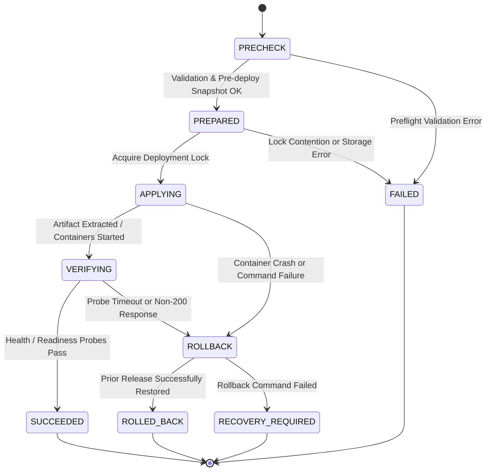

# 07 DEPLOYMENT SAFETY CONTRACT & RELEASE STATE MACHINE

**Document ID**: `REMED-P0-07`  
**Phase**: Phase 0 — Current-State Reconciliation & Architecture Freeze  
**Author**: Antigravity Conversation 1 — Developer  
**Status**: Cross-Platform Deployment State Machine Specification Frozen  
**Review Status**: PENDING INDEPENDENT REVIEW & CODEX AUDIT GATE  

---

## 1. Release Safety Principles

A deployment is not merely the execution of a shell script; it is a transactional state transition from one proven immutable release to another.

The deployment engine must guarantee:
1. **Never Report Success Without Readiness**: A release is not successful until health probes affirmatively prove application readiness.
2. **Immutable Artifact Identity**: Every deployment operates on exact, content-addressed artifacts (Docker image digest or SHA-256 zipped archive), never mutable tags or branch names.
3. **Deterministic Automated Rollback**: Any failure during preparation, application, or verification automatically initiates rollback to the verified prior release.
4. **Crash-Resilient State Persistence**: If the control plane host crashes mid-deployment, the state machine resumes or reconciles the deployment upon startup.

---

## 2. Release State Machine Diagram

---

## 3. Explicit State Transition Specification

### State 1: `PRECHECK`
- **Actions**:
  - Verify caller authorization (`Deployments_Execute` permission on specific `ServiceId`).
  - Validate release target (must be explicit SemVer tag or content digest; reject `main`, `master`, `latest`).
  - Validate artifact availability (Docker registry manifest exists or artifact ZIP exists on disk).
  - Check disk headroom (minimum 15% free space required).
  - Verify database connectivity and pending schema migrations.
  - Acquire distributed service lock (prevent concurrent deployments to the same service).
- **Failure Condition**: Any check fails → transition to `FAILED` with explicit error code.

### State 2: `PREPARED`
- **Actions**:
  - Persist `DeploymentRecord` to database with state `PREPARED`.
  - Execute automated pre-deployment safety snapshot:
    - **Database**: Trigger database dump or transactional snapshot.
    - **Filesystem**: Create snapshot archive of current running release directory.
  - Record the proven active release identifier as `RollbackTarget`.
- **Failure Condition**: Snapshot creation fails → transition to `FAILED` (no changes made to running application).

### State 3: `APPLYING`
- **Actions**:
  - Update `DeploymentRecord` to `APPLYING`.
  - **Linux Topology**: Pull pinned image by digest; update Compose service block via AST YAML parser; start container with `--no-deps`.
  - **Windows Topology**: Drain traffic via `app_offline.htm`; extract artifact archive into versioned release folder; point IIS virtual directory or physical path; recycle AppPool.
- **Failure Condition**: Process failure, extraction error, or exit code != 0 → transition to `ROLLBACK`.

### State 4: `VERIFYING`
- **Actions**:
  - Update `DeploymentRecord` to `VERIFYING`.
  - Poll application HTTP readiness probe (e.g. `/health` or `/healthz`) every 2 seconds up to configurable timeout (default 60s).
  - Expected criteria: HTTP status 200 with JSON payload `{"status":"Healthy"}`.
  - Verify absence of crash loops (`DockerEvents` die/restart events or IIS worker process restarts).
- **Transition**:
  - All probes succeed within window → transition to `SUCCEEDED`.
  - Probe fails or times out → transition to `ROLLBACK`.

### State 5: `SUCCEEDED`
- **Actions**:
  - Mark `DeploymentRecord` as `SUCCEEDED` with completion timestamp, probe latency, and active image digest.
  - Switch live traffic routing (Traefik / IIS).
  - Release distributed deployment lock.
  - Record audit log entry in `SystemLogs` table.
  - Emit outbound deployment success event (Email / Webhook).

### Failure Path 1: `ROLLBACK`
- **Actions**:
  - Log root cause error in `DeploymentRecord`.
  - Initiate automated restoration of `RollbackTarget`:
    - **Linux**: Revert service image in Compose to prior digest; execute `docker compose up -d --no-deps`.
    - **Windows**: Restore pre-deploy archive or switch IIS physical path back to prior release folder; recycle AppPool.
    - **Database**: If schema migration was executed and failed, restore pre-deploy DB snapshot.
  - Execute verification probe against restored prior release.
- **Transition**:
  - Prior release responds healthy → transition to `ROLLED_BACK`.
  - Prior release fails to recover → transition to `RECOVERY_REQUIRED`.

### Terminal State: `ROLLED_BACK`
- System safely restored to prior stable release. Outage prevented. Alert dispatched to operators with failure details and rollback confirmation.

### Terminal State: `RECOVERY_REQUIRED`
- Catastrophic failure: Both replacement release and rollback failed. Critical P0 incident alert dispatched. System requires human operator intervention.

---

## 4. Crash Recovery & Startup Reconciliation

When the DevOps Manager API or host VM restarts:
1. Startup service queries all `DeploymentRecords` in non-terminal states (`PRECHECK`, `PREPARED`, `APPLYING`, `VERIFYING`, `ROLLBACK`).
2. Engine checks actual Docker daemon or IIS AppPool state:
   - If container/site is running the new release and responds healthy to probe → reconcile status to `SUCCEEDED`.
   - If container/site is stopped, crashing, or probe fails → initiate automated `ROLLBACK` to restore previous stable release.
   - If previous state is indeterminate → mark `RECOVERY_REQUIRED` and alert operator.
3. Completely replaces the previous behavior of blindly marking records `INTERRUPTED` without infrastructure reconciliation.
