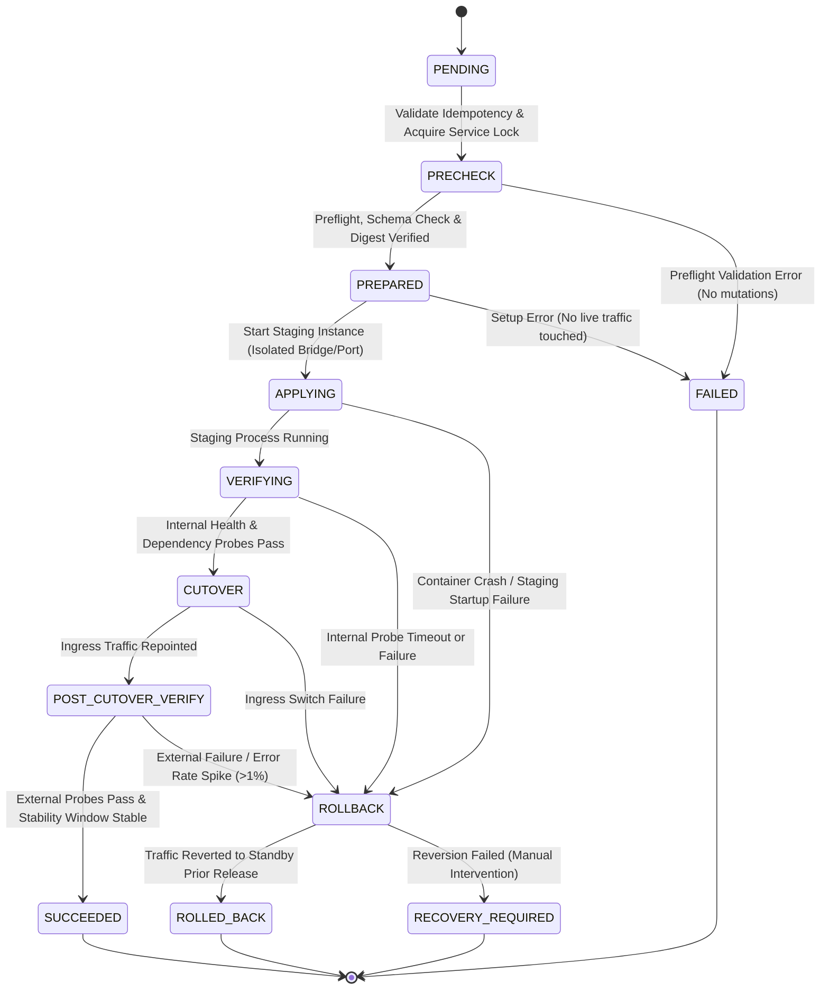

# 07 DEPLOYMENT SAFETY CONTRACT & RELEASE STATE MACHINE

**Document ID**: `REMED-P0-07`  
**Phase**: Phase 0 — Current-State Reconciliation & Architecture Freeze  
**Author**: Antigravity Conversation 1 — Developer  
**Status**: Authoritative Cross-Platform Deployment Contract Frozen (Codex C0-01 Remediation Applied)  
**Audit Reference**: `docs/remediation/phase-0-codex-gate/06_CODEX_FINDINGS_REGISTER.md` (Finding `C0-01`)  

---

## 1. Release Safety Principles

A deployment is not merely the execution of a script; it is a transactional state transition from one proven immutable release to another.

The deployment engine enforces these fundamental invariants:
1. **`SUCCEEDED` Means Serving Live Traffic**: A release is NEVER marked `SUCCEEDED` until traffic cutover has executed and post-cutover verification affirmatively proves healthy operation.
2. **Separation of Stages**: Artifact preparation, staging deployment, readiness verification, traffic cutover, and finalization are strictly separated. The previous known-good release is never destroyed before the new candidate is verified.
3. **Application Rollback != Database Rollback**: Application rollback reverts container/artifact routing. Database restoration is a separate, destructive disaster recovery operation that is NEVER automatically triggered on deployment failure.
4. **Backward-Compatible Schema Migrations**: All migrations follow the Expand/Contract pattern so that Release $N-1$ remains fully functional if Release $N$ fails.
5. **Durable Persistence & Single-Host Atomic Locking**: Every transition is persisted to PostgreSQL before executing side effects. Deployments acquire per-service advisory locks and validate request idempotency keys.
6. **Fenced Crash & Reboot Reconciliation**: Orphaned or interrupted deployments reconcile deterministically without unverified promotions.

---

## 2. Definitive Release State Machine

---

## 3. Explicit State Transition Specification

### State 0: `PENDING`
- **Actions**:
  - Receive deployment request containing client-generated `IdempotencyKey`.
  - Validate caller authorization (`Deployments_Execute` scoped to tenant).
  - Attempt insert into `DeploymentRecord` with unique constraint `(TenantId, ServiceName, IdempotencyKey)`.
  - If duplicate request: return HTTP 409 Conflict with active status or cached terminal result.
- **Transition**: Advance to `PRECHECK`.

### State 1: `PRECHECK`
- **Actions**:
  - Acquire single-host per-service atomic lock via PostgreSQL advisory lock `hashtext(ServiceName)`.
  - Validate release target (must be explicit SemVer tag or content digest; reject `main`, `master`, `latest`).
  - Validate artifact availability (Docker registry manifest exists or artifact ZIP exists on disk).
  - Check disk headroom ($\ge 5\text{ GB}$ free space required).
  - Verify database connectivity and schema migration eligibility (reject destructive migrations without explicit `--allow-irreversible-migration` flag).
- **Failure Condition**: Any check fails → transition to `FAILED`. Zero physical mutations have occurred; lock is released.

### State 2: `PREPARED`
- **Actions**:
  - Persist `DeploymentRecord` state `PREPARED`.
  - Download/pull artifact and verify cryptographic SHA-256 digest.
  - Staging directories / images prepared.
  - Record the proven active release identifier as `RollbackTarget`.
  - Execute pre-deployment database migration preflight.
- **Failure Condition**: Preparation fails → transition to `FAILED` (no changes made to running application).

### State 3: `APPLYING`
- **Actions**:
  - Update `DeploymentRecord` to `APPLYING`.
  - **Linux Topology**: Spawn new container on internal Docker bridge (`${SERVICE}_vNext`), unbound from public ports.
  - **Windows Topology**: Extract files to staging directory `C:\inetpub\staging\${SERVICE}_vNext`; create staging IIS AppPool on loopback port (`127.0.0.1:508x`).
  - **Database Migration**: If migrations are pending, execute additive Expand migrations.
- **Failure Condition**: Process failure, container crash, or exit code != 0 → transition to `ROLLBACK`.

### State 4: `VERIFYING`
- **Actions**:
  - Update `DeploymentRecord` to `VERIFYING`.
  - Poll staging HTTP readiness probe (`GET http://staging-endpoint/health`) every 2 seconds for 3 consecutive successes over a 15-second window.
  - Verify database connectivity and internal dependencies via probe payload.
  - Verify zero crash events on staging instance.
- **Transition**:
  - All probes succeed within 60s timeout → transition to `CUTOVER`.
  - Probe fails or times out → transition to `ROLLBACK`.

### State 5: `CUTOVER`
- **Actions**:
  - Update `DeploymentRecord` to `CUTOVER`.
  - **Linux Topology**: Atomically update Traefik dynamic router YAML to repoint domain traffic to `${SERVICE}_vNext`.
  - **Windows Topology**: Atomically update IIS URL rewrite rules / bindings to repoint incoming traffic to new AppPool.
  - Previous release is kept running in standby (quiesced).
- **Transition**:
  - Routing switch successful → transition to `POST_CUTOVER_VERIFY`.
  - Routing switch fails → transition to `ROLLBACK`.

### State 6: `POST_CUTOVER_VERIFY`
- **Actions**:
  - Update `DeploymentRecord` to `POST_CUTOVER_VERIFY`.
  - Execute synthetic HTTP probes against the public domain endpoint.
  - Monitor live error rates during a mandatory 30-second observation window (5xx error rate must remain $< 1\%$).
- **Transition**:
  - Probes pass and stability window clean → transition to `SUCCEEDED`.
  - Probes fail or error rate spikes → transition to immediate automated `ROLLBACK`.

### State 7: `SUCCEEDED` (Terminal)
- **Actions**:
  - Mark `DeploymentRecord` as `SUCCEEDED` with completion timestamp, probe latency, and active image digest.
  - Release per-service atomic lock.
  - After a 10-minute grace period, decommission previous container / AppPool according to image retention rules.
  - Emit outbound deployment success event (Audit Log, Webhook).

### Failure Branch 1: `FAILED` (Terminal)
- Precheck or preparation failed before mutations. Lock released. No live service touched. Zero recovery needed.

### Failure Branch 2: `ROLLBACK`
- **Actions**:
  - Log root-cause error in `DeploymentRecord`.
  - Revert traffic routing in Traefik / IIS to point back to the previous standby release (`RollbackTarget`).
  - Stop and destroy the failed staging container / AppPool.
  - **Database Policy**: Database snapshot is **NOT** automatically restored. Because migrations follow Expand/Contract, Release $N-1$ remains 100% compatible.
  - Probe restored prior release.
- **Transition**:
  - Prior release responds healthy → transition to `ROLLED_BACK`.
  - Prior release fails to respond healthy → transition to `RECOVERY_REQUIRED`.

### Terminal State: `ROLLED_BACK`
- Traffic safely reverted to prior stable release. Release marked `ROLLED_BACK`. Service lock released. Operator alerted.

### Terminal State: `RECOVERY_REQUIRED`
- Catastrophic condition: Automated rollback failed or split-brain detected. System locked. High-priority P0 alert dispatched. Zero automated destructive actions permitted; requires human operator intervention.

---

## 4. Crash Recovery & Startup Reconciliation

When the DevOps Manager API or host VM restarts:
1. Startup worker queries all `DeploymentRecords` in non-terminal states (`PENDING`, `PRECHECK`, `PREPARED`, `APPLYING`, `VERIFYING`, `CUTOVER`, `POST_CUTOVER_VERIFY`, `ROLLBACK`).
2. For each non-terminal record:
   - Verify worker PID and heartbeat timestamp.
   - If heartbeat is expired (> 60s) and state is prior to `CUTOVER`: Staging instance is pruned; previous release is confirmed active; record marked `FAILED`.
   - If state is `CUTOVER` or `POST_CUTOVER_VERIFY`: Controller probes public endpoint and router configuration. If traffic was not cut over, mark `FAILED`. If traffic cutover was partially applied or failing, initiate automated `ROLLBACK` to restore previous release.
   - If state is unresolvable: Mark `RECOVERY_REQUIRED` and trigger high-priority alert.
3. No non-terminal deployment is ever automatically promoted to `SUCCEEDED` without verified live traffic serving.

---

## 5. Database Migration and Rollback Boundaries

### 5.1 Application Rollback vs. Database Restoration
- **Application Rollback** is safe, automated, and non-destructive: traffic is redirected back to the previous container.
- **Database Restoration** is destructive: restoring a database dump wipes out all data written since the backup.

### 5.2 Expand / Contract Migration Rules
1. All migrations in Release $N$ must be strictly backward-compatible with Release $N-1$.
2. Destructive migrations (dropping columns, changing data types) must be split into two releases:
   - Release $N$: Add new column and dual-write.
   - Release $N+1$: Read from new column, stop writing to old column, drop old column.
3. Destructive restorations require explicit operator authorization (`--confirm-destructive-data-loss`), system quiescing, and an ad-hoc safety dump prior to execution.
