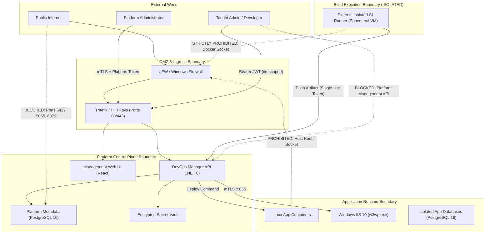

# 08 SECURITY BOUNDARIES & TRUST ARCHITECTURE

**Document ID**: `REMED-P0-08`  
**Phase**: Phase 0 — Current-State Reconciliation & Architecture Freeze  
**Author**: Antigravity Conversation 1 — Developer  
**Status**: Authoritative Security Architecture Frozen (Codex C1-01 Remediation Applied)  
**Audit Reference**: `docs/remediation/phase-0-codex-gate/06_CODEX_FINDINGS_REGISTER.md` (Finding `C1-01`)  

---

## 1. Security Threat Model Overview

The `VPS-INFRA` platform operates in single-VM and multi-tenant environments where customer workloads, CI runners, and control-plane components interact. Establishing strict isolation boundaries is essential to prevent host takeover, cross-tenant data compromise, and secret leakage.

---

## 2. Core Security Boundaries

### 2.1 Boundary 1: CI Build Sandbox vs. Host & Daemon (MR-01, MR-16)
- **Vulnerability Solved**: Historical F01 allowed untrusted .NET tests to access `/var/run/docker.sock`, granting full root control over host storage and production containers.
- **Enforced Boundary**:
  - Test and build execution MUST NOT mount `/var/run/docker.sock`.
  - Builds execute inside isolated, unprivileged container workers in External Isolated CI with `--security-opt=no-new-privileges:true`.
  - Host filesystems (`/var/www`, `/root`) are strictly excluded from build container mounts.
  - Resource limits (`--memory=2g`, `--cpus=2`, `--pids-limit=256`) enforced on all build processes.

### 2.2 Boundary 2: Database Network & Credential Isolation (MR-05, MR-06, MR-28)
- **Vulnerability Solved**: Historical F06, F07, and DEF-28 gave application containers shared superuser access and published database ports (`5432`, `3306`, `5050`) to `0.0.0.0`, bypassing UFW.
- **Enforced Boundary**:
  - Database ports MUST NOT be published to public interfaces (`0.0.0.0`). They bind strictly to `127.0.0.1` or exist exclusively within the internal `traefik_net` overlay bridge.
  - Every application receives a dedicated, auto-generated least-privilege PostgreSQL role with rights confined strictly to its assigned database.
  - Applications cannot inspect or access other databases or platform management tables.

### 2.3 Boundary 3: Secret Lifecycle & Credential Sanitization (MR-02, MR-03, MR-04, MR-07)
- **Vulnerability Solved**: Historical F02, F03, F04, and F20 included committed RSA private keys (`google-drive-credentials.json`), fallback JWT secrets, unredacted tokens in read DTOs, and expected secrets in webhook logs.
- **Enforced Boundary**:
  - Zero committed secret files. The leaked Google Cloud service account key is revoked in IAM and permanently removed from distribution.
  - Initial setup (`setup.sh`, `setup.ps1`) cryptographically generates high-entropy random secrets for JWT signing, database credentials, and admin passwords. Startup halts immediately if known static fallback strings are detected.
  - All read DTOs (e.g. `ProjectDTO`) strip sensitive fields (`GitAccessToken`, `WebhookToken`). Plaintext tokens are encrypted in the database at rest using AES-256-GCM.
  - Path traversal containment (DEF-15) enforced via `Path.GetFullPath` canonicalization against tenant sandbox root.

### 2.4 Boundary 4: Platform Administration vs. Tenant Administration Role Separation (DEF-11, MR-08)
- **Vulnerability Solved**: Historical DEF-11 incorrectly stated that new tenants receive a "tenant-scoped SuperAdmin", while `ci-server/api/auth.js:82` granted `SuperAdmin` global authorization bypass across all tenants and platform infrastructure.
- **Enforced Boundary**:
  - **`PlatformSuperAdmin`**: Platform operator role only. Grants access to global host configuration, deployment runners, and system telemetry. Zero access to customer tenant secrets or private data.
  - **`TenantAdmin`**: Customer administrative role scoped strictly to the organization's `TenantId` (`@Claim: tid`). Grants rights to manage tenant users, services, deployments, and logs. **CANNOT** perform platform-global operations, access the Docker socket, or bypass tenant isolation.
  - Every API request derives `TenantId` from the cryptographically validated JWT token. Entity queries enforce `WHERE TenantId = @currentTenantId` at the repository/DbContext layer.

### 2.5 Boundary 5: Windows Filesystem Sandbox & Authentication (MR-24, MR-25)
- **Vulnerability Solved**: Historical DEF-32 and DEF-36 allowed unconstrained `PhysicalPath` extraction to sensitive OS paths (`C:\Windows`) using hardcoded bearer token `"SuperCiSecretKey123!"`.
- **Enforced Boundary**:
  - `TMK.Agent.Windows` runs as a compiled .NET Worker Windows Service under `NT AUTHORITY\LocalService`.
  - Communication between DevOps Manager and `TMK.Agent.Windows` is secured via mutual TLS (mTLS) with pinned CA certificate validation on port 5055.
  - Deployment extraction is restricted to `C:\inetpub\staging\` and `C:\inetpub\wwwroot\`. Paths containing `..` or pointing outside these roots are rejected with HTTP 403 Forbidden.

---

## 3. Comprehensive Token Trust Contract

A "valid JWT" is NOT sufficient authorization. Every incoming token must satisfy a strict multi-dimensional trust verification contract:

| Token Type | Issuer (`iss`) | Audience (`aud`) | Subject (`sub`) | Tenant (`tid`) | Roles / Scopes | Lifetime | Algorithm | Storage & Revocation |
|---|---|---|---|---|---|---|---|---|
| **Platform User** | `https://auth.vps-infra.local/` | `devops-manager-api` | `usr_uuid` | `PLATFORM` | `PlatformSuperAdmin`, `PlatformAuditor` | 15 min | `RS256` / `HS256` ($\ge 256$ bits) | In-memory only; sliding refresh token (max 8h); revocation denylist in Redis. |
| **Tenant User** | `https://auth.vps-infra.local/` | `devops-manager-api`, `customer-portal` | `usr_uuid` | `uuid_tenant` | `TenantAdmin`, `TenantDeveloper`, `TenantViewer` | 15 min | `RS256` / `HS256` ($\ge 256$ bits) | Bearer header; immediate revocation on user suspension or security stamp update. |
| **CI Runner Token** | `https://ci.vps-infra.local/` | `devops-manager-api` | `runner_uuid` | `uuid_tenant` | `ci:artifact:push` | 10 min | `RS256` | Ephemeral single-use token tied to specific build ID. |
| **Windows Agent Token** | `https://auth.vps-infra.local/` | `tmk-agent-windows` | `agent_uuid` | `PLATFORM` | `agent:deploy:execute` | 1 hour | `RS256` | Local Machine DPAPI certificate store; mTLS thumbprint pairing. |
| **AMS Inter-Service** | `https://devops-manager.vps-infra.local/` | `ams-calculator` | `svc_devops` | Contextual `tid` | `service:ams:recalculate` | 5 min | `RS256` | Private Docker network only; short-lived; rejects forwarded public tokens. |

### 3.1 Mandatory Token Validation Pipeline
1. **Algorithm Whitelist**: Enforce `RS256` or `HS256` ($\ge 256$ bits). Reject `alg: "none"` and key-confusion attacks.
2. **Issuer & Audience Validation**: Assert `iss` matches trusted authority and `aud` matches target service identifier.
3. **Expiration & Clock Skew**: Validate `exp > UtcNow` with max 60s clock skew.
4. **Tenant Context Binding (`tid`)**: For tenant-scoped routes, assert `tid` matches the URL route parameter. Return HTTP 403 Forbidden on mismatch.
5. **Revocation Check**: Check `jti` against token denylist.
6. **Default Key Halt**: Startup halts immediately if the configured secret matches known default strings.

---

## 4. Phase 1 Negative Test Acceptance Suite

Phase 1 security implementation must satisfy all 9 explicit negative test criteria:
1. **Default Signing Key**: Application startup halts with `InvalidConfigurationException`.
2. **Invalid / None Algorithm**: Requests with `alg: "none"` return HTTP 401 Unauthorized.
3. **Audience Mismatch**: Token with `aud: "other-service"` returns HTTP 401 Unauthorized.
4. **Tenant Mismatch**: User with `tid: "A"` querying `/api/v1/tenants/B/resources` returns HTTP 403 Forbidden.
5. **Platform Operation by Tenant Admin**: `TenantAdmin` attempting `POST /api/v1/platform/upgrade` returns HTTP 403 Forbidden.
6. **Unauthenticated Inter-Service**: Request to `/api/v1/ams/recalculate` without valid service token returns HTTP 401 Unauthorized.
7. **Invalid Windows Agent Token**: Request to `TMK.Agent.Windows` on port 5055 with invalid/missing token returns HTTP 401 Unauthorized.
8. **Least-Privilege Database Breach**: App database user attempting `SELECT * FROM "PlatformUsers"` returns permission denied.
9. **Public Database Scan**: Automated scan detects ports 5432 and 6379 bound to `127.0.0.1` / internal bridge; public access fails.
