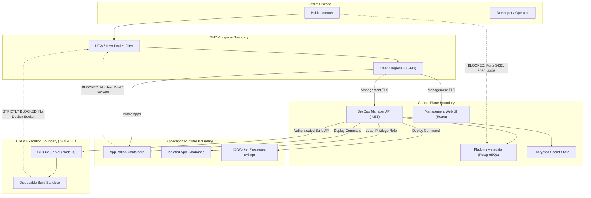

# 08 SECURITY BOUNDARIES & TRUST ARCHITECTURE

**Document ID**: `REMED-P0-08`  
**Phase**: Phase 0 — Current-State Reconciliation & Architecture Freeze  
**Author**: Antigravity Conversation 1 — Developer  
**Status**: Security Architecture and Trust Model Frozen  
**Review Status**: PENDING INDEPENDENT REVIEW & CODEX AUDIT GATE  

---

## 1. Security Threat Model Overview

The `VPS-INFRA` platform operates in single-VM and multi-tenant environments where developer code, automated builds, and control-plane components interact. Establishing strict isolation boundaries is essential to prevent host takeover, cross-tenant data compromise, and secret leakage.

---

## 2. Core Security Boundaries

### 2.1 Boundary 1: CI Build Sandbox vs. Host & Daemon (MR-01, MR-16)
- **Vulnerability Solved**: Historical F01 allowed untrusted .NET tests to receive `/var/run/docker.sock`, granting full root control over host storage and production containers.
- **Enforced Boundary**:
  - Test and build execution MUST NOT mount `/var/run/docker.sock`.
  - Builds execute inside isolated, unprivileged container workers with `--security-opt=no-new-privileges:true`.
  - Host filesystems (`/var/www`, `/root`) are strictly excluded from build container mounts.
  - Resource limits (`--memory=2g`, `--cpus=2`, `--pids-limit=256`) enforced on all build processes.

### 2.2 Boundary 2: Database Network & Credential Isolation (MR-05, MR-06)
- **Vulnerability Solved**: Historical F06 and F07 gave application containers shared superuser access and published database ports (`5432`, `3306`, `5050`) to `0.0.0.0`, bypassing UFW.
- **Enforced Boundary**:
  - Database ports MUST NOT be published to public interfaces (`0.0.0.0`). They bind strictly to `127.0.0.1` or exist exclusively within the internal `traefik_net` overlay bridge.
  - Every application receives a dedicated, auto-generated least-privilege PostgreSQL role with rights confined strictly to its assigned database.
  - Applications cannot inspect or access other databases or platform management tables.

### 2.3 Boundary 3: Secret Lifecycle & Credential Sanitization (MR-02, MR-03, MR-04, MR-07)
- **Vulnerability Solved**: Historical F02, F03, F04, and F20 included committed RSA private keys (`google-drive-credentials.json`), fallback JWT secrets, unredacted tokens in read DTOs, and expected secrets in webhook logs.
- **Enforced Boundary**:
  - Zero committed secret files. The leaked Google Cloud service account key is revoked in IAM and permanently removed from distribution.
  - Initial setup (`setup.sh`, `setup.ps1`) cryptographically generates high-entropy random secrets for JWT signing, database credentials, and admin passwords. Startup halts immediately if known static fallback strings are detected.
  - All read DTOs (e.g. `ProjectDTO`) strip sensitive fields (`GitAccessToken`, `WebhookToken`). Plaintext tokens are encrypted in the database at rest.
  - Log sanitization middleware redacts authorization headers, webhook tokens, and CLI passwords.

### 2.4 Boundary 4: Multi-Tenant RBAC & BOLA Prevention (MR-08)
- **Vulnerability Solved**: Historical F04, F05, and DEF-06 allowed project queries without tenant filters and checked roles without service ownership, enabling cross-tenant substitution.
- **Enforced Boundary**:
  - Every API request derives `TenantId` from the cryptographically validated JWT token.
  - Entity queries enforce `WHERE TenantId = @currentTenantId` at the repository/DbContext layer.
  - Resource authorization checks ensure that the principal owns or is assigned to the specific `ServiceId` prior to triggering deployments, reading logs, or altering configurations.

### 2.5 Boundary 5: Windows Filesystem Sandbox & Authentication (MR-24, MR-28)
- **Vulnerability Solved**: Historical DEF-32 and DEF-36 allowed unconstrained `PhysicalPath` extraction to sensitive OS paths (`C:\Windows`) using hardcoded bearer token `"SuperCiSecretKey123!"`.
- **Enforced Boundary**:
  - The Windows Agent requires a cryptographically generated, per-installation bearer secret. Default keys are rejected on startup.
  - Deployment extraction is restricted to an approved base root (e.g. `C:\inetpub\wwwroot\apps`). Paths containing `..` or pointing outside the root are rejected with HTTP 403 Forbidden.
  - Windows NTFS ACLs constrain IIS AppPool identities (`IIS AppPool\{AppPoolName}`) to read/execute permissions within their specific release directory.
