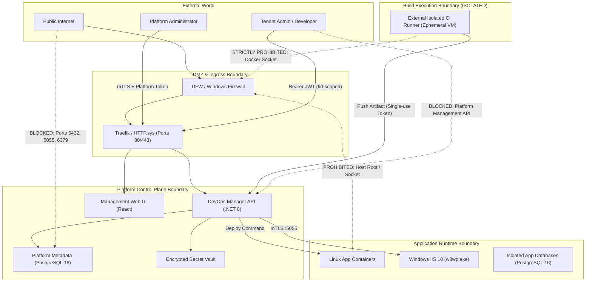

# 08 SECURITY BOUNDARIES & TRUST ARCHITECTURE

**Document ID**: `REMED-P0-08`  
**Phase**: Phase 0 — Current-State Reconciliation & Architecture Freeze  
**Author**: Antigravity Conversation 1 — Developer  
**Status**: Authoritative Security Architecture Frozen (Codex C1-01 Remediation Applied)  
**Audit Reference**: `docs/remediation/phase-0-codex-gate/06_CODEX_FINDINGS_REGISTER.md` (Finding `C1-01`)  

---

## 1. Security Threat Model Overview

The `VPS-INFRA` platform operates in single-VM and multi-tenant environments where customer workloads, CI runners, and control-plane components interact. Establishing strict isolation boundaries is essential to prevent host takeover, cross-tenant data compromise, and secret leakage.

---

## 2. Core Security Boundaries

### 2.1 Boundary 1: CI Build Sandbox vs. Host & Daemon (MR-01, MR-16)
- **Vulnerability Solved**: Historical F01 allowed untrusted .NET tests to access `/var/run/docker.sock`, granting full root control over host storage and production containers.
- **Enforced Boundary**:
  - Test and build execution MUST NOT mount `/var/run/docker.sock`.
  - Builds execute inside isolated, unprivileged container workers in External Isolated CI with `--security-opt=no-new-privileges:true`.
  - Host filesystems (`/var/www`, `/root`) are strictly excluded from build container mounts.
  - Resource limits (`--memory=2g`, `--cpus=2`, `--pids-limit=256`) enforced on all build processes.

### 2.2 Boundary 2: Database Network & Credential Isolation (MR-05, MR-06, MR-28)
- **Vulnerability Solved**: Historical F06, F07, and DEF-28 gave application containers shared superuser access and published database ports (`5432`, `3306`, `5050`) to `0.0.0.0`, bypassing UFW.
- **Enforced Boundary**:
  - Database ports MUST NOT be published to public interfaces (`0.0.0.0`). They bind strictly to `127.0.0.1` or exist exclusively within the internal `traefik_net` overlay bridge.
  - Every application receives a dedicated, auto-generated least-privilege PostgreSQL role with rights confined strictly to its assigned database.
  - Applications cannot inspect or access other databases or platform management tables.

### 2.3 Boundary 3: Secret Lifecycle, Credential Sanitization & Path Containment (MR-02, MR-03, MR-04, MR-07)
- **Vulnerability Solved**: Historical F02, F03, F04, and F20 included committed RSA private keys (`google-drive-credentials.json`), fallback JWT secrets, unredacted tokens in read DTOs, and expected secrets in webhook logs.
- **Enforced Boundary**:
  - Zero committed secret files. The leaked Google Cloud service account key is revoked in IAM and permanently removed from distribution.
  - Initial setup (`setup.sh`, `setup.ps1`) cryptographically generates high-entropy random secrets for JWT signing, database credentials, and admin passwords. Startup halts immediately if known static fallback strings are detected.
  - All read DTOs (e.g. `ProjectDTO`) strip sensitive fields (`GitAccessToken`, `WebhookToken`). Plaintext tokens are encrypted in the database at rest using AES-256-GCM.
  - **Path Traversal Containment (DEF-15 / MR-04 / MR-08 / MR-24)**: Client-supplied arbitrary physical roots are strictly prohibited. Every target path is validated against the server-registered deployment root assigned to the authorized tenant/service/environment using normalized segment-boundary containment:
    - Root and candidate paths are fully resolved with trailing directory separators.
    - Sibling-prefix attacks (`tenant-a` matching `tenant-ab`), alternate drive letters, UNC paths, `..` traversals, null bytes, and archive entry traversal escapes are rejected immediately with HTTP 400/403.

### 2.4 Boundary 4: Platform Administration vs. Tenant Administration Role Separation & Break-Glass Governance (DEF-11, MR-08)
- **Vulnerability Solved**: Historical DEF-11 incorrectly stated that new tenants receive a "tenant-scoped SuperAdmin", while `ci-server/api/auth.js:82` granted `SuperAdmin` global authorization bypass across all tenants and platform infrastructure.
- **Enforced Boundary**:
  - **`PlatformSuperAdmin`**: Platform operator role only. Grants access to global host configuration, deployment runners, and system telemetry. Under normal operations, platform operators have zero access to customer tenant private data or application databases.
  - **`TenantAdmin`**: Customer administrative role scoped strictly to the organization's `TenantId` (`@Claim: tid`). Grants rights to manage tenant users, services, deployments, and logs. **CANNOT** perform platform-global operations, access the Docker socket, or bypass tenant isolation.
  - **Exceptional Break-Glass Governance**: In catastrophic support or disaster recovery scenarios, exceptional access to tenant resources is permitted only under strict controls:
    1. Explicit customer-consented ticket context and authorized operational purpose.
    2. Time-bounded, short-lived elevated credential issuance (max 1 hour).
    3. Immutable cryptographic audit logging of all session commands.
    4. Immediate credential invalidation/revocation upon task completion.
  - Every API request derives `TenantId` from the cryptographically validated JWT token. Entity queries enforce `WHERE TenantId = @currentTenantId` at the repository/DbContext layer.

### 2.5 Boundary 5: Windows Filesystem Sandbox & Dedicated Service Identity (MR-24, MR-25)
- **Vulnerability Solved**: Historical DEF-32 and DEF-36 allowed unconstrained `PhysicalPath` extraction to sensitive OS paths (`C:\Windows`) using hardcoded bearer token `"SuperCiSecretKey123!"`.
- **Enforced Boundary**:
  - `TMK.Agent.Windows` runs as a compiled .NET Worker Windows Service under a **dedicated least-privilege Windows service identity** (e.g. `NT SERVICE\TMKAgent`) with explicitly granted rights: IIS administration / AppPool control, deployment filesystem rights (`C:\inetpub\staging\` and `C:\inetpub\wwwroot\`), and SCM inspection; explicitly restricted from unrelated OS directories and LocalSystem privileges.
  - Communication between DevOps Manager and `TMK.Agent.Windows` is secured via mutual TLS (mTLS) with pinned CA certificate validation on port 5055, supplemented by scoped short-lived request tokens.
  - Deployment extraction is restricted to `C:\inetpub\staging\` and `C:\inetpub\wwwroot\apps\{tenant}\`. Segment-boundary containment verifies that candidate paths cannot escape the assigned tenant root.

---

## 3. Comprehensive Token Trust Contract

A "valid JWT" is NOT sufficient authorization. Every incoming token must satisfy a strict multi-dimensional trust verification contract:

| Token Type | Permitted Issuers (`iss`) | Audience (`aud`) | Subject (`sub`) | Tenant (`tid`) | Roles / Scopes | Lifetime | Algorithm | Storage & Revocation |
|---|---|---|---|---|---|---|---|---|
| **Platform User** | `https://auth.vps-infra.local/` | `devops-manager-api` | `usr_uuid` | `PLATFORM` | `PlatformSuperAdmin`, `PlatformAuditor` | 15 min | `RS256` / `HS256` ($\ge 256$ bits) | In-memory only; sliding refresh token (max 8h); durable PostgreSQL revocation repository (`RevokedTokens`) accelerated by Redis 7 distributed cache and local process cache (`Local Cache -> Redis -> PostgreSQL`). Redis 7 is a first-class standard production component; PostgreSQL remains the durable source of truth. Cache misses and Redis outages fall back safely to PostgreSQL, never bypassing security truth. |
| **Tenant User** | `https://auth.vps-infra.local/` | `devops-manager-api`, `customer-portal` | `usr_uuid` | `uuid_tenant` | `TenantAdmin`, `TenantDeveloper`, `TenantViewer` | 15 min | `RS256` / `HS256` ($\ge 256$ bits) | Bearer header; durable database denylist + immediate revocation on user suspension or security stamp update. |
| **CI Runner Token** | `https://ci.vps-infra.local/` | `devops-manager-api` | `runner_uuid` | `uuid_tenant` | `ci:artifact:push` | 10 min | `RS256` | Ephemeral single-use token tied to specific build ID; durable one-time consumption. |
| **Windows Agent Token** | `https://auth.vps-infra.local/` | `tmk-agent-windows` | `agent_uuid` | `PLATFORM` | `agent:deploy:execute` | 1 hour | `RS256` | Local Machine DPAPI certificate store; mTLS thumbprint pairing. |
| **AMS Inter-Service** | `https://devops-manager.vps-infra.local/` | `ams-calculator` | `svc_devops` | Contextual `tid` | `service:ams:recalculate` | 5 min | `RS256` | Private Docker network only; short-lived; rejects forwarded public tokens. |

### 3.1 Service-Specific Token Validation Pipeline
Every API endpoint must execute validation against its declared service acceptance contract:
1. **Algorithm Check**: Strictly enforce approved algorithm (`RS256` or `HS256` with high-entropy secret $\ge 256$ bits). Explicitly reject `alg: "none"` and asymmetric-to-symmetric key confusion attacks.
2. **Service-Specific Issuer & Audience Validation**: Validate that `iss` matches the designated authority for that specific endpoint (e.g. user routes accept `auth.vps-infra.local`; CI artifact endpoints accept `ci.vps-infra.local`; AMS endpoints accept `devops-manager.vps-infra.local`) and `aud` matches target service identifier.
3. **Expiration & Clock Skew**: Validate `exp > UtcNow` with max 60s clock skew. Reject expired tokens with HTTP 401 Unauthorized.
4. **Tenant Context Binding (`tid`)**: For tenant-scoped routes, assert `tid` matches the URL route parameter. Return HTTP 403 Forbidden on mismatch (`SEC_TENANT_MISMATCH`).
5. **Durable Capability-Based Revocation**: Check `jti` (JWT ID) against the multi-tiered revocation pipeline (`Local Cache -> Redis 7 -> PostgreSQL`). PostgreSQL (`RevokedTokens` table) is the durable authority. Revocation writes must commit durably to PostgreSQL before being considered successful, followed by Redis cache update/invalidation.
   - **Revocation Effective Point**: Revocation is security-effective when the PostgreSQL revocation transaction commits. For any authorization decision initiated after that point, stale cache state MUST NOT authorize the revoked credential. The request MUST be denied (`DENY` / HTTP 401). Stale local or Redis cache entries and delayed invalidation Pub/Sub messages must NEVER permit authorization.
   - **Degraded Fallback**: If Redis is unavailable or cache validity is uncertain, the pipeline falls back to PostgreSQL or fails closed; it NEVER fails open.
6. **Key Lifecycle & Historical Key Rejection**: Signing keys must be cryptographically high-entropy and rotated periodically. Tokens signed by retired/historical keys outside the active grace window return HTTP 401 Unauthorized.
7. **Default Key Halt**: Application startup halts immediately if configured signing secret matches known default strings.

---

## 4. Phase 1 Negative Test Acceptance Suite

Phase 1 security implementation must satisfy all explicit negative test criteria:
1. **Default Signing Key**: Application startup halts with `InvalidConfigurationException`.
2. **Invalid / None Algorithm**: Requests with `alg: "none"` return HTTP 401 Unauthorized.
3. **Audience Mismatch**: Token with `aud: "other-service"` returns HTTP 401 Unauthorized.
4. **Wrong Issuer**: Request presented with token signed by untrusted or incorrect issuer returns HTTP 401 Unauthorized.
5. **Historical / Retired Signing Key**: Token signed by rotated-out key returns HTTP 401 Unauthorized.
6. **Valid Token with Wrong / Insufficient Scope**: Valid tenant user attempting platform operation, or CI token attempting AMS recalculation, returns HTTP 403 Forbidden.
7. **Tenant Mismatch**: User with `tid: "A"` querying `/api/v1/tenants/B/resources` returns HTTP 403 Forbidden.
8. **Platform Operation by Tenant Admin**: `TenantAdmin` attempting `POST /api/v1/platform/upgrade` returns HTTP 403 Forbidden.
9. **Expired Token**: Request with expired token returns HTTP 401 Unauthorized.
10. **Revoked Token / Credential**: Request with revoked `jti` or revoked credential returns HTTP 401 Unauthorized immediately across all instances and application restarts. For requests evaluated post-PostgreSQL revocation commit, stale cache state MUST NOT admit the credential; zero authorization grace period is permitted.
11. **Unauthenticated Inter-Service**: Request to `/api/v1/ams/recalculate` without valid service token returns HTTP 401 Unauthorized.
12. **Invalid Windows Agent Token**: Request to `TMK.Agent.Windows` on port 5055 with invalid/missing token returns HTTP 401 Unauthorized.
13. **Least-Privilege Database Breach**: App database user attempting `SELECT * FROM "PlatformUsers"` returns permission denied.
14. **Public Database Scan**: Automated scan detects ports 5432 bound to `127.0.0.1` / internal bridge; public access fails.
15. **Path Traversal & Sibling-Prefix Attacks**: Deployment request with `..\..\Windows`, UNC path, or sibling-prefix path (`tenant-a` vs `tenant-ab`) returns HTTP 400/403.

