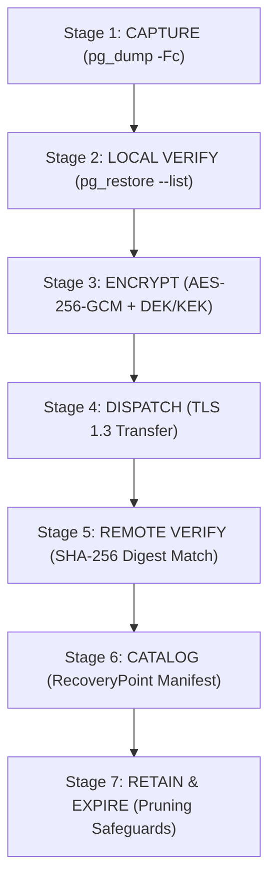

# 09 BACKUP, DISASTER RECOVERY & RESTORATION CONTRACT

**Document ID**: `REMED-P0-09`  
**Phase**: Phase 0 — Current-State Reconciliation & Architecture Freeze  
**Author**: Antigravity Conversation 1 — Developer  
**Status**: Authoritative Disaster Recovery Contract Frozen (Codex C1-02 Remediation Applied)  
**Audit Reference**: `docs/remediation/phase-0-codex-gate/06_CODEX_FINDINGS_REGISTER.md` (Finding `C1-02`)  

---

## 1. Disaster Recovery Engineering Axiom

A backup does not exist simply because a dump utility was invoked. A backup exists ONLY when:
1. It is generated consistently without transaction corruption.
2. It is verified using format-aware engine validation (`pg_restore --list`).
3. It is encrypted client-side with AES-256-GCM using an escrowed key kit before leaving the host.
4. It is dispatched offsite beyond the failure domain of the source host.
5. Its remote integrity is proven via authenticated digest verification.
6. It is cataloged in an authenticated `RecoveryPoint` manifest.
7. It has been proven restorable to a clean, isolated host under total-source-host-loss simulation.

> [!CAUTION]
> **Prohibited Equivalence**:
> Backup Creation $\neq$ Client-Side Encryption $\neq$ Offsite Dispatch $\neq$ Remote Digest Verification $\neq$ Source-Host-Loss Restoration.
> These stages must be tracked, logged, and reported as distinct states.

---

## 2. Seven-Stage Backup Lifecycle Pipeline

### Stage 1: Backup Creation (Local Dump)
- **Engine**: PostgreSQL 16 native utility: `pg_dump -Fc` (custom format).
- **Execution**: Consistent snapshot mode; non-blocking to active read/write transactions.
- **Status**: `LOCAL_CREATED`.

### Stage 2: Format-Aware Local Verification
- **Verification Engine**: `pg_restore --list "$LOCAL_BACKUP_PATH"`.
- **Integrity Assertion**: Validates archive header, compression blocks, and table of contents. Prohibits invalid `gzip -t` on custom `-Fc` archives. Verifies non-zero table and schema counts.
- **Status**: `FORMAT_VERIFIED`.

### Stage 3: Client-Side Envelope Encryption
- **Encryption Algorithm**: AES-256-GCM with a single-use 256-bit Data Encryption Key (DEK).
- **Key Wrap**: DEK is encrypted using the Key Encryption Key (KEK) derived from the off-host BIP-39 recovery passphrase.
- **Metadata**: Generates IV, Auth Tag, and wrapped DEK; plaintexts never leave the host.
- **Status**: `ENCRYPTED`.

### Stage 4: Offsite Dispatch (Transfer)
- **Transport**: Encrypted TLS 1.3 streaming transfer to provider-neutral storage (S3-compatible, Azure Blob, SFTP).
- **Failure Handling**: Network timeouts or provider errors are not swallowed. Retries use exponential backoff (up to 3 attempts).
- **Status**: `DISPATCHED_PENDING_VERIFICATION`.

### Stage 5: Remote Verification (Digest Match)
- **Integrity Check**: Control plane queries remote storage API to list the uploaded object, verify reported byte length, and compare remote SHA-256 digest against local pre-transfer digest.
- **Status**:
  - Remote digest matches local digest → Mark `VERIFIED_OFFSITE`.
  - Remote file missing or size mismatch → Mark `OFFSITE_FAILED` and trigger high-priority alert (MR-18).

### Stage 6: Catalog Recovery Point
- **Manifest**: Creates signed `RecoveryPoint` manifest containing tenant ID, environment, database version, plain/encrypted SHA-256, encryption metadata, and retention class.
- **Status**: `CATALOGED`.

### Stage 7: Retention Policy & Pruning Safeguards
- **Retention Classes**: `PRE_DEPLOY` (7 days, min 2 points), `DAILY` (30 days, min 7 points), `WEEKLY` (90 days, min 4 points).
- **Safety Invariant**: Cleanup MUST NEVER silently delete the only restorable recovery point. Under storage pressure, oldest `PRE_DEPLOY` points are pruned first, while the minimum verified recovery floor is strictly maintained.

---

## 3. Total Host Loss & Offsite Key Escrow Contract

If the source VPS is completely destroyed:
1. **Independent Recovery Assets**: Recovery does NOT depend on files, local registries, or secret vaults existing on the destroyed host.
2. **Offsite Recovery Kit**: Recovery requires only:
   - Offsite storage endpoint and read credentials;
   - The 24-word BIP-39 recovery passphrase (stored off-host during initial setup);
   - Standard clean base OS (Ubuntu 24.04 LTS or Windows Server 2022).
3. **Complete Platform Recovery Set**:
   - `DatabaseArchive` (`.dump.enc`): Application and tenant data;
   - `PlatformManifest` (`manifest.json.enc`): Docker image tags, routing rules, and tenant configurations;
   - `AssetStorage`: Customer file uploads and project templates.

---

## 4. Realistic RPO and RTO Operational Targets

Unrealistic claims of "instantaneous snapshot rollback" are eliminated. Measured targets for Phase 5 Gate A testing:

| Metric | Target | Verification Method |
|---|---|---|
| **Recovery Point Objective (RPO)** | **24 hours** (Scheduled daily) **1 hour** (Pre-deploy) | Daily backups run successfully every 24h; pre-deploy backups run immediately before deployment. |
| **Recovery Time Objective (RTO)** | **30 minutes** | Disaster drill restores 10 GB database onto freshly provisioned VM and starts services within 30 minutes. |

---

## 5. Pre-Restore Safety Contract (MR-15)

Database restoration is a destructive disaster recovery operation, NOT an automated release rollback.
1. **Mandatory Confirmation**: Requires operator confirmation flag `--confirm-destructive-data-loss`.
2. **Quiescing**: Active connections are terminated; application placed in Maintenance Mode.
3. **Pre-Restore Safety Dump**: An ad-hoc physical dump of the live database is taken immediately before restoration to preserve any post-snapshot writes for forensic recovery.
