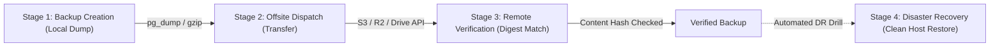

# 09 BACKUP, DISASTER RECOVERY & RESTORATION CONTRACT

**Document ID**: `REMED-P0-09`  
**Phase**: Phase 0 — Current-State Reconciliation & Architecture Freeze  
**Author**: Antigravity Conversation 1 — Developer  
**Status**: Authoritative Disaster Recovery Specification Frozen  
**Review Status**: PENDING INDEPENDENT REVIEW & CODEX AUDIT GATE  

---

## 1. Disaster Recovery Engineering Axiom

A backup does not exist simply because a dump utility was invoked. A backup exists ONLY when:
1. It is generated consistently without transaction corruption.
2. It is dispatched offsite beyond the failure domain of the source VM.
3. Its remote integrity and checksum have been verified by an independent query.
4. It has been proven restorable to a clean, isolated host under source-host-loss simulation.

> [!CAUTION]
> **Prohibited Equivalence**:
> Backup Creation $\neq$ Offsite Dispatch $\neq$ Remote Verification $\neq$ Source-Host-Loss Restoration.
> These four lifecycle stages must be tracked, logged, and reported as distinct states.

---

## 2. Four-Stage Backup Lifecycle Model

### Stage 1: Backup Creation (Local Dump)
- **Engine**: Native utility execution (`pg_dump -Fc` for PostgreSQL).
- **Execution**: Consistent snapshot mode; non-blocking to active read/write transactions.
- **Verification**: Exit code must be 0; output file size must exceed minimum threshold; gzip integrity test (`gzip -t`) must pass.
- **Status in Database**: `LOCAL_CREATED` (never mark backup complete at this stage).

### Stage 2: Offsite Dispatch (Transfer)
- **Transport**: Encrypted TLS transfer to independent offsite storage provider (AWS S3, Cloudflare R2, or Google Drive).
- **Failure Handling**: Network timeouts or provider errors must NOT be swallowed. Retries use exponential backoff (up to 3 attempts).
- **Current Defect Resolved**: Fixes historical F11 where `UploadFileAsync` return value was ignored and success logged before upload completion.
- **Status in Database**: `DISPATCHED_PENDING_VERIFICATION`.

### Stage 3: Remote Verification (Digest Match)
- **Integrity Check**: Control plane queries remote storage API to list the uploaded object, verify reported byte length, and compare remote MD5/ETag or SHA-256 with the locally calculated hash.
- **Status Transition**:
  - Remote digest matches local digest → Mark `VERIFIED_OFFSITE`.
  - Remote file missing or size mismatch → Mark `OFFSITE_FAILED` and trigger high-priority alert (MR-18).

### Stage 4: Bare-Metal Restore under Source-Host Loss
- **Recovery Requirement**: If the source VM suffers catastrophic failure or destruction, operators must be able to restore the entire platform and customer data on a freshly provisioned host using ONLY the remote credentials and the offsite backup archive.
- **Automated DR Drill**: Periodic automated drill executing on a disposable staging instance:
  1. Pulls latest backup from offsite storage.
  2. Restores database schema and data into clean container.
  3. Verifies schema table count and executes business invariant integrity checks.
  4. Requires exit code 0 (fixing historical F12 where exit codes > 1 only logged a warning).

---

## 3. Strict Pre-Restore Safety Contract (MR-15)

Executing a database restore over an existing database carries severe operational risk. The restore engine enforces:

1. **Automated Pre-Restore Safety Snapshot**:
   - Before executing any restore operation, the system automatically takes an instantaneous snapshot of the current live database.
   - If the restore fails mid-flight or the operator realizes the wrong backup was selected, the system provides 1-click instantaneous reversion to the pre-restore state.

2. **Transaction Abort & Process Isolation**:
   - Restore commands terminate active client connection pools to prevent partial writes.
   - Multi-statement restores execute within transactions where supported, rolling back entirely on error.

3. **In-Flight Validation**:
   - Corrupted or partial dump files (e.g. missing required database roles or truncated tables) fail the restore operation immediately and alert the operator.
