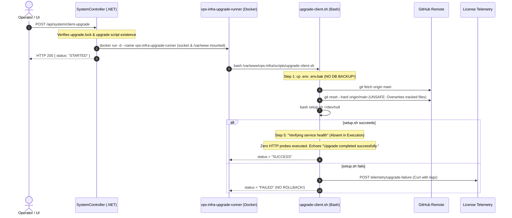

# 12 PLATFORM UPGRADE SYSTEM INVESTIGATION & CURRENT-STATE REPORT

**Document ID**: `REMED-P0-12`  
**Phase**: Phase 0 — Current-State Reconciliation & Architecture Freeze  
**Author**: Antigravity Conversation 1 — Developer  
**Baseline Date**: 2026-09-29  
**Target Master ID**: **MR-19** (Upgrade Safety Engine)  
**Review Status**: PENDING INDEPENDENT REVIEW & CODEX AUDIT GATE  

---

## 1. Executive Summary

In post-audit commits `9097c59` ("feat: implement UI platform release check and decoupled upgrade runner") and `36354a3` ("feat(release): support SemVer release versioning and increment to v2.2.0"), UI cards and a decoupled Docker supervisor container were added to manage platform upgrades.

However, forensic review confirms that **historical finding F18 remains OPEN**. While the upgrade process now survives the restart of `devops-api-prod` by executing in a separate container (`vps-infra-upgrade-runner`), the underlying upgrade script (`scripts/upgrade-client.sh`) still:
1. Performs an unsafe `git reset --hard origin/main` without cryptographic verification.
2. Backs up only the `.env` file (completely omitting database and container state backups).
3. Executes zero real health verification before declaring `SUCCESS`.
4. Has zero automated rollback capability if the new release is defective.

> [!CRITICAL]
> **Architectural Verdict**: A detached process surviving an API restart is NOT sufficient evidence of safe platform upgrades.

---

## 2. Complete Upgrade Path Walkthrough & Technical Analysis



---

## 3. Forensic Evaluation Against Safety Dimensions

### 3.1 Source of Available Version & Version Pinning
- **Code Anchor**: [`SystemController.cs:65-209`](file:///d:/company/products/vps-infra/vps-infra-server/devops-manager/api/Controllers/SystemController.cs#L65-L209)
- **Mechanism**: Executes `git ls-remote origin main` and `git ls-remote --tags origin`. Compares against local `VERSION` file or `git rev-parse HEAD`.
- **Defect**: Allows upgrading directly to mutable `origin/main` rather than strictly enforcing signed, immutable release tags.

### 3.2 Artifact Identity & Integrity Verification
- **Code Anchor**: [`vps-infra/scripts/upgrade-client.sh:139-152`](file:///d:/company/products/vps-infra/vps-infra/scripts/upgrade-client.sh#L139-L152)
- **Mechanism**: Executes `git reset --hard origin/main`.
- **Defect**: Zero signature checking, zero GPG commit verification, and zero SHA-256 manifest verification. Untrusted or compromised commits on the remote branch are applied directly to the host.

### 3.3 Process Survival & Decoupled Execution
- **Code Anchor**: [`SystemController.cs:257-268`](file:///d:/company/products/vps-infra/vps-infra-server/devops-manager/api/Controllers/SystemController.cs#L257-L268)
- **Mechanism**: Launches `vps-infra-upgrade-runner` via Docker daemon with `/var/run/docker.sock`, `/var/www`, `/root/.ssh`, and `/root/.docker` mounted.
- **Assessment**: Successfully survives `devops-api-prod` container recreation. However, it uses mutable image tag `ghcr.io/tmk-computers/tmk-devops-api:latest`, which may re-pull an untested runner image.

### 3.4 Upgrade State Persistence
- **Code Anchor**: [`vps-infra/scripts/upgrade-client.sh:34-50`](file:///d:/company/products/vps-infra/vps-infra/scripts/upgrade-client.sh#L34-L50)
- **Mechanism**: Writes JSON to `/var/www/vps-infra/upgrade.status` via atomic temporary file move (`update_status`). Polled by `GET /api/system/client-update`.
- **Assessment**: Status persistence is functional for UI progress tracking.

### 3.5 Preflight Checks & Pre-Upgrade Backup
- **Code Anchor**: [`vps-infra/scripts/upgrade-client.sh:19-27, 127-133`](file:///d:/company/products/vps-infra/vps-infra/scripts/upgrade-client.sh#L19-L27)
- **Preflight**: Only checks for `upgrade.lock`. Zero checks for disk space, database connection health, running deployments, or container CPU/RAM headroom.
- **Backup**: Executes `cp "$SCRIPT_DIR/.env" "$SCRIPT_DIR/.env.bak.$(date +%Y%m%d%H%M%S)"`.
- **CRITICAL GAP**: **Zero database backup is taken before the upgrade**. If new platform migrations corrupt the schema or fail, the database is left in a corrupted or half-migrated state with no recovery snapshot.

### 3.6 Health Verification Absence & Unverified Success Declaration (F18)
- **Code Anchor**: [`vps-infra/scripts/upgrade-client.sh:170-178`](file:///d:/company/products/vps-infra/vps-infra/scripts/upgrade-client.sh#L170-L178)
- **Script Text**:
  ```bash
  # 5. Verify healthy services
  CURRENT_STEP="Verifying service health"
  echo "▶ $CURRENT_STEP..."
  update_status "IN_PROGRESS" "Verifying service health..." "$CURRENT_STEP"

  NEW_COMMIT="$(git rev-parse --short HEAD 2>/dev/null || echo "latest")"
  echo "✅ Upgrade completed successfully to commit $NEW_COMMIT."
  update_status "SUCCESS" "Platform successfully upgraded to version $NEW_COMMIT." "Completed"
  exit 0
  ```
- **Forensic Truth**: No HTTP requests, no `curl`, no docker health check queries, and no container inspection commands are run. Health verification is absent from the execution path, resulting in an unverified success declaration. Even if `devops-api-prod` failed to start or crashed on boot, the upgrade status is still recorded as `SUCCESS`.

### 3.7 Failure Detection & Rollback Defect
- **Failure Detection**: Detects non-zero exit codes from `git fetch`, `git reset`, and `setup.sh`.
- **Failure Action**: Invokes `report_telemetry` to dispatch an error report to `https://license.tmkcomputers.in/api/v1/telemetry/upgrade-failure`.
- **CRITICAL GAP**: **Zero rollback is performed**. The codebase remains stuck at `origin/main`, the old containers may be shut down or destroyed, and the system is left in a broken state.

---

## 4. Required Remediation Specifications for Phase 10 (MR-19)

1. **Enforce Immutable Release Pinning**:
   - Upgrades must target explicit SemVer tags (e.g. `v2.3.0`) verified against a signed release manifest.
2. **Automated Pre-Upgrade Full Snapshot**:
   - Automated full PostgreSQL database dump (`pg_dump`) and volume backup before applying changes.
3. **True Post-Upgrade Readiness Verification**:
   - Script must poll `http://127.0.0.1:5000/api/system/status` or health probe for 60 seconds.
   - All platform containers (`traefik`, `devops-api-prod`, `devops-web-prod`, `ci-api-prod`, `shared_postgres`) must report healthy.
4. **Automated Atomic Rollback**:
   - If health probes fail within the timeout, the upgrade runner must automatically:
     - Revert git repository to previous commit SHA.
     - Restore pre-upgrade database backup.
     - Restart previous Docker container images.
     - Verify restored platform health before exiting with failure.
