# 13 CI/CD TRUST MODEL & ARCHITECTURAL SEPARATION

**Document ID**: `REMED-P0-13`  
**Phase**: Phase 0 — Current-State Reconciliation & Architecture Freeze  
**Author**: Antigravity Conversation 1 — Developer  
**Baseline Date**: 2026-09-29  
**Review Status**: PENDING INDEPENDENT REVIEW & CODEX AUDIT GATE  

---

## 1. Executive Summary

A continuous integration (CI) build runner executes untrusted, arbitrary user code (developer commits, third-party packages, build scripts, test suites). In contrast, the control plane hosts sensitive credentials, master databases, and production application workloads.

To eliminate the existential risk of host takeover identified in **F01** and **DEF-08**, the platform establishes a strict architectural bifurcation between two CI models:
1. **Gate-A Supported Model**: External Isolated CI (GitHub Actions, GitLab CI, external runner VMs).
2. **Future / Separately Certified Model**: TMK Integrated CI (Internal CI server on shared host).

> [!IMPORTANT]
> **Preservation Rule**: Existing integrated CI functionality in `ci-server/` is retained for testing and development, but is strictly isolated from Gate-A production workloads.

---

## 2. Comparison of CI Architecture Models

```mermaid
graph TD
    subgraph "Model 1: Gate-A Certified (External Isolated CI)"
        ExtGit["GitHub / GitLab Remote"]
        ExtRunner["Isolated Ephemeral CI Worker (GitHub Actions / GitLab Runner)"]
        ExtRegistry["Secure Container Registry (GHCR / Docker Hub)"]
        ProdHost["Single-VM Production Host (VPS-INFRA)"]
        
        ExtGit --> ExtRunner
        ExtRunner -- "Build & Test in Sandbox" --> ExtRunner
        ExtRunner -- "Push Immutable Digest" --> ExtRegistry
        ExtRegistry -- "Pull Pinned Digest" --> ProdHost
    end

    subgraph "Model 2: Future / Experimental (TMK Integrated CI)"
        LocalGit["Customer Git Repo"]
        CiServer["ci-server (Node.js API)"]
        SharedDaemon["Shared Production Docker Daemon"]
        ProdDB["Production PostgreSQL"]
        
        LocalGit --> CiServer
        CiServer -. "VULNERABILITY: Socket Mount" .-> SharedDaemon
        SharedDaemon -. "RISK: Host Takeover" .-> ProdDB
    end
```

---

## 3. Model 1: Gate-A Supported Production Model (External Isolated CI)

Under the approved Pilot Gate A profile:
1. **Build & Test Isolation**:
   - Application source code is compiled and tested on external, disposable CI runners (e.g. GitHub-hosted runners).
   - Untrusted code execution occurs completely outside the production VM.
2. **Artifact Delivery**:
   - The external CI pipeline pushes immutable, scanned container images (with content digests) to an authenticated Docker registry.
   - For Windows IIS, compiled release archives (`.zip`) are signed and delivered via secure webhook or pre-authenticated upload.
3. **Control Plane Ingress**:
   - The production host receives only deployment trigger webhooks containing exact release digests.
   - The host daemon pulls the pre-built image and runs deployment verification probes.
   - Zero compilation tools, zero build dependencies, and zero untrusted test processes execute on the production host.

---

## 4. Model 2: Future Integrated CI Qualification Requirements

Before the integrated `ci-server` can be certified for production Gate B support, it must prove the following safety contract:

1. **Docker Socket Elimination**:
   - The test and build execution containers MUST NOT mount `/var/run/docker.sock`.
   - Build containers must use rootless build tools (e.g. `kaniko`, `buildah`, or Docker-in-Docker within an isolated VM).
2. **Resource Cgroups & Admission Governance (MR-16)**:
   - CI builds must enforce hard memory limits (`--memory=2048m`), CPU caps (`--cpus=2`), and PID limits (`--pids-limit=256`).
   - A global admission controller must reject or queue builds if host free RAM drops below 20%.
3. **Tenancy & BOLA Enforcement (MR-08)**:
   - Tenant isolation must prevent Tenant A from triggering builds or reading logs for Tenant B's services.
4. **Network Egress Containment**:
   - Build containers must execute on an isolated network bridge that cannot route traffic to `127.0.0.1:5432` or the host control-plane API.
