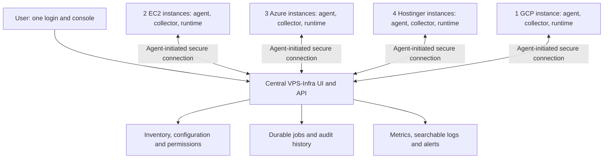

# Multi-VPS Central Management Plan

Status: Proposed architecture. This document does not describe functionality already implemented.

## 1. Objective

Extend VPS-Infra into one platform for monitoring and managing multiple independent Linux instances, regardless of hosting provider.

For example, one person could own:

- 2 AWS EC2 instances.
- 3 Azure VMs.
- 4 Hostinger VPS instances.
- 1 GCP VM.

That person should sign in once to see all 10 instances, inspect system health and logs, manage applications and databases, run deployments, check backups, and perform maintenance. Routine operations should happen inside the central platform without visiting individual VPS dashboards or provider consoles.

The primary scope is managing the operating system and workloads on existing instances. Provider account integration is optional. Provisioning instances, billing, resizing, provider snapshots, and powering on a stopped VM are separate capabilities.

## 2. Current Project and Review Boundaries

This repository contains infrastructure scripts, Docker Compose configurations, application templates, and documentation. DevOps Manager and CI applications run from prebuilt images; their application source is not included here.

Consequently, infrastructure behavior can be reviewed directly, while documented UI/API capabilities need verification against the application source and running services before implementation estimates or compatibility guarantees are made.

The IDE-referenced `docs/04-operations-and-troubleshooting/04-runtime-state-and-git-pull.md` was not present in the reviewed checkout.

| Existing component | Role in the proposed platform |
| --- | --- |
| [`setup.sh`](setup.sh) | Install and configure each server's runtime |
| [`docker-compose.yml`](docker-compose.yml) | Run existing DevOps and CI components locally |
| [`infra`](infra) | Existing local lifecycle, status, logs, and PostgreSQL backup commands |
| [`templates/`](templates/) | Generate application workloads for selected servers |
| [`network/traefik/docker-compose.yml`](network/traefik/docker-compose.yml) | Keep application routing and certificate management local |
| [`db/manage-databases.sh`](db/manage-databases.sh) | Local database engine lifecycle operations |
| [`scripts/upgrade-client.sh`](scripts/upgrade-client.sh) | Starting point for tracked runtime upgrades |
| Documented CI/API synchronization | Integration point for builds and deployment targets |
| Documented backups, licensing, and AI features | Capabilities requiring application-source verification and central integration |

The existing `all-in-one`, `devops-only`, and `ci-only` modes divide responsibilities between machines. They do not establish a fleet-wide inventory, shared management console, or general remote command system.

## 3. Recommended Architecture

Use a central management service with a management agent and telemetry collector on each server. Retain the existing Docker-based runtime and local application routing.

Provider, region, environment, and server group are inventory attributes. Routine management uses the same agent protocol on every supported instance, without requiring cloud provider account credentials.

Application traffic continues going directly to each VPS through its existing Traefik instance. The central platform does not become an application traffic proxy, and centralizing management does not automatically provide cross-server application failover.

## 4. Central User Experience

The home page should answer: **What needs attention across all my servers?**

Show server counts, unreachable instances, unhealthy applications, resource pressure, failed deployments, failed or overdue backups, expiring certificates, and recent operations.

A server selector should support all servers, named groups such as Production, and individual instances. Each instance also gets a detail page.

| Area | Central visibility and actions |
| --- | --- |
| System | CPU, RAM, swap, load, disk usage, inodes, disk I/O, network traffic, uptime |
| Containers | State, health checks, restart counts, resource consumption, start/stop/restart |
| Applications | Projects, environments, domains, deployed versions, deploy/redeploy/rollback |
| Logs | Live tail and historical search across hosts, containers, applications, and system services |
| Databases | Engine health, storage, connections, lifecycle actions, supported provisioning operations |
| Backups | Schedules, last success, offsite copy status, retention, restore jobs, restore verification |
| CI/CD | Runner availability, builds, logs, test results, artifacts, deployment destinations |
| Domains and SSL | Routes, DNS observations, certificate expiry, external HTTP checks, routing errors |
| Maintenance | Cleanup previews, scheduled jobs, runtime upgrades, execution results |
| Administration | Permissions, configuration, secret references, licensing, operation history |
| AI features | If verified in the application source, allow diagnosis within authorized server scope and configured data-sharing policy |

Routine workflows must be native to the central console. Selecting Logs should show logs; restarting a service should execute and display its result without opening another server's dashboard.

## 5. Components on Each Server

### Management agent

Run the management agent as a host service supervised by `systemd`, independently of the application Compose stack.

Responsibilities:

- Enroll and maintain a secure connection to the central service.
- Discover host information, Compose projects, containers, applications, and database engines.
- Report inventory, capabilities, runtime version, configuration revision, and heartbeat.
- Accept authorized, explicitly supported operations.
- Execute operations locally and verify their outcomes.
- Persist job receipts and progress across agent restarts.
- Report Docker or local DevOps API failure even when those components are unavailable.

Use narrowly defined privileged helpers where practical. Docker management access is highly privileged; merely mounting its socket read-only does not make the Docker API a read-only management interface.

### Telemetry collector

Use an established collector rather than implementing a metrics and log pipeline inside the management agent. Grafana Alloy is a candidate for host/container metrics and logs.

Collect container stdout/stderr, configured application log files, relevant system journals, and upgrade/build logs. Enable and collect Traefik access logs and metrics where required; do not assume every source is already configured.

Telemetry should carry stable organization, server, application, service, and environment identifiers. Avoid high-cardinality metric labels such as arbitrary request IDs or complete log messages.

Separate telemetry permissions from command execution privileges where possible. Redact credentials and sensitive fields before transmission.

## 6. Connectivity and Enrollment

Each server initiates outbound encrypted connections to central endpoints on port 443. Commands return over an established connection or authenticated polling. Telemetry can use separate authenticated upload endpoints behind the same ingress.

Central management should not require public Docker sockets or database ports. Private instances need outbound connectivity or a routed private connection to the central service.

Onboarding:

1. Select Add Server in the console.
2. Generate a short-lived, single-use enrollment token scoped to an organization.
3. Install the agent on the instance.
4. Exchange the token for unique node credentials, preferably using mutual TLS.
5. Discover the current installation and show it centrally.
6. Adopt existing workloads without reinstalling them or moving their persistent data.

Generate an immutable `server_id`; do not use the IP address, hostname, container name, or license key as identity. Rotate credentials and support revocation. A cloned server must enroll with a new identity instead of sharing its source instance's credentials.

## 7. Inventory and Ownership Model

Core records should include:

| Record | Essential information |
| --- | --- |
| Organization | Owner, users, policies, retention settings |
| Server | Stable ID, organization, name, provider, region, groups, environment, last seen |
| Agent | Version, credentials, capabilities, supported operation/protocol versions |
| Application/service | Global ID, project, environment, server mapping, local resource mapping |
| Deployment | Target server, image digest, configuration revision, previous revision, result |
| Job | Actor, target, operation, parameters, expiry, status, progress, outcome |
| Backup | Source server/database, archive location, checksum, timestamps, verification status |
| Alert | Target, rule, severity, state, acknowledgment, resolution |
| Audit event | Actor, action, target, time, approved scope, result |

Scope local identifiers by server so identical names such as `shared_postgres` do not collide across instances.

Track desired configuration separately from observed state. Initially import existing installations as observed state; central management should not silently overwrite local changes. Once resources are centrally managed, show configuration drift and make the reconciliation policy explicit.

## 8. Remote Operations as Durable Jobs

Example: restart an application on `hostinger-prod-03`.

1. Verify the user's permission for that server and application.
2. Create a durable job with an explicit target and operation.
3. Deliver the job to the target agent.
4. Persist its acceptance locally before execution.
5. Execute the restart and check the resulting application health.
6. Report progress and a final result to the console.
7. Preserve an audit record of the request and outcome.

Jobs need unique IDs, deadlines, timeouts, compatible capability requirements, and states such as queued, accepted, running, succeeded, failed, expired, canceled, and outcome unknown.

Delivery may be repeated after a connection failure. Persist job receipts and deduplicate delivery; never assume transport provides exactly-once execution. Reconcile uncertain outcomes before retrying operations that may already have succeeded.

Serialize conflicting mutations per resource. A deploy, restore, and upgrade must not modify the same resource concurrently. Cancellation is best-effort once a destructive step has begun; the UI must distinguish cancellation requested from cancellation completed.

Expose typed actions such as restart service, create backup, deploy image, and upgrade runtime. Avoid accepting arbitrary shell commands as the default management API. Destructive actions require a preview of affected resources and explicit confirmation.

Bulk operations should create a parent job with a result for each target. Use bounded concurrency, maintenance windows, staged rollout, and stop-on-failure rules.

## 9. Central Services and Storage

| Component | Responsibility |
| --- | --- |
| Central UI and API | Unified workflows, authorization, inventory, orchestration |
| PostgreSQL | Inventory, permissions, configuration metadata, jobs, schedules, audit records |
| Durable worker | Job dispatch, retries, timeouts, reconciliation |
| Prometheus-compatible metrics backend | Historical measurements and metric queries |
| Loki | Log ingestion, retention, and search |
| Object storage | Backup archives and build artifacts where needed |
| Alert evaluator | Resource thresholds, missing heartbeats, failures, notification routing |

For the initial fleet, a PostgreSQL-backed job queue can avoid introducing a separate broker before it is needed. Choose metrics storage and retention based on measured ingestion; configure a backend that supports the collector's remote-write protocol.

Keep telemetry queries behind the central API's authorization boundary. Users should not need separate Grafana or Loki access for normal workflows. Loki does not include its own authentication layer, so protect both ingestion and query endpoints with authenticated access.

Size the deployment after a pilot measures metrics cardinality, log bytes per day, query patterns, retention, and backup volume. Server count alone is insufficient for a reliable capacity estimate.

## 10. Health, Logs, and Alerts

Represent health as several independent signals:

- Agent reachable: management connectivity works.
- Host healthy: resource usage and system services are acceptable.
- Container healthy: container state and configured checks pass.
- Application reachable: an HTTP or other service probe succeeds.
- Data protection healthy: backups and offsite copies are current and verified as applicable.

A running process is not proof of application health. A missing heartbeat does not prove a VM is powered off.

Show `Unreachable — last seen 4 minutes ago`, with timestamps on stale metrics. Use external probes to distinguish application availability from agent connectivity where possible.

Configure resource-pressure alerts, crash-loop detection, backup age/failure alerts, certificate expiry, failed deployments, and failed scheduled maintenance. Support grouping, acknowledgment, maintenance suppression, and recovery notifications.

Use bounded local telemetry buffers with backoff during outages. Report dropped records and collection gaps; never allow telemetry buffering to consume the application's remaining disk. Retention and quotas must be explicit and configurable.

## 11. Deployments, CI, and Runtime Lifecycle

Keep builds and deployment destinations separate:

1. Select an authorized CI runner with suitable capabilities.
2. Build and test an application once.
3. Publish an immutable image digest and associate artifacts/test results.
4. Select target servers or a server group.
5. Deploy through each target's agent.
6. Verify application health and record per-target results.

Do not assume the current single DevOps API URL and shared CI secret already support routing to many independent installations. Verify and extend the CI integration contract.

For runtime upgrades, pin releases/images, perform preflight checks, preserve configuration, upgrade a canary first, and proceed in batches. Verify actual readiness before reporting success.

Keep agent upgrades separate from application-stack upgrades so management connectivity survives ordinary runtime maintenance. Maintain protocol compatibility across a documented version window.

Rollback can restore a prior application image/configuration only when data compatibility permits it. Database migrations and data restores need their own recovery plans; a Compose restart does not guarantee zero downtime.

## 12. Databases, Backups, and Recovery

Run database operations locally through engine-specific adapters. Maintain backups and schedules independently of a live browser session or central connection.

For each backup, track creation, successful upload, checksum, retention, and restore verification separately. A local dump alone is not a confirmed offsite backup.

Store backup objects under organization/server/database namespaces with scoped credentials. Restore jobs must identify the exact destination and archive, verify compatibility, and protect against accidental overwrites.

For server replacement, enroll the replacement as a new node, restore supported data, deploy the recorded application/configuration revisions, verify health, and update routing/DNS through the chosen workflow. Do not promise a fixed recovery time without measured restore and DNS behavior.

Central management itself needs backups of inventory, configuration, audit data, and recoverable credential material under appropriate protection.

## 13. Permissions, Secrets, and Licensing

Enforce organization and server permissions in the backend, including metrics, log searches, artifact downloads, and jobs. UI filtering alone is insufficient.

Use role-based permissions for viewing, deployment, operations, database administration, and organization administration, with server/project scopes. Provide strong authentication and an audit trail for privileged actions.

Give each node only the secrets required for its workloads. Store central secrets encrypted, avoid logging them, and reference them by ID in ordinary configuration records.

Node identity and command authentication must be separate from licensing. Display per-node license status centrally and verify any proposed organization-level entitlement or server-count limits with the licensing implementation. Do not assume one current license can authorize all nodes.

If integrating AI diagnosis, preserve existing data-sharing preferences. Explicitly define whether local-only analysis runs on each node or on organization-controlled central infrastructure; central log collection changes the original per-VPS data boundary.

## 14. Failure Behavior and Operational Limits

| Failure | Expected behavior |
| --- | --- |
| Central platform unavailable | Applications, local routing, databases, and installed backup schedules continue |
| Node disconnected | Mark telemetry stale, buffer within limits, expire unsafe queued work |
| Agent restarts mid-job | Recover journal and reconcile actual state before retrying |
| Docker unavailable | Host agent remains available to report and support authorized recovery |
| One node compromised | Revoke that node's credentials; it cannot authenticate as other nodes |
| Metrics/log storage unavailable | Report degraded visibility and avoid false healthy status |
| VM powered off or OS unreachable | Show incident and retained evidence; provider-level recovery may be required |

Monitor the central platform from an independent location. A central outage must be able to generate an alert even when its own alert engine is down.

An agent cannot power on a stopped VM or recover a completely unreachable OS. Provider power controls require optional provider integrations or emergency provider access. This does not prevent a single-console experience for routine health, logs, and operating tasks.

## 15. Repository Issues to Resolve Before Remote Mutations

The review found implementation/documentation differences relevant to fleet operations:

- `infra` references older DevOps/CI Compose paths absent from this checkout.
- `uninstall.sh` references `db/docker-compose.yml`, while current database Compose files live in engine-specific directories.
- `scripts/upgrade-client.sh` announces health verification but does not perform application health checks before marking success.
- The upgrade runner resets tracked files to `origin/main`; fleet upgrades need version pinning, configuration separation, and an explicit local-change policy.
- Database Compose files publish host ports despite documentation describing them as unexposed. Review actual bindings and firewall behavior before fleet onboarding.
- Backup schedules, maintenance behavior, and some UI/API capabilities described in documentation are not fully established by the infrastructure source here. Verify them against the application implementations.

These are prerequisites to making local operations repeatable across many servers, not changes performed as part of this document.

## 16. Delivery Plan

| Phase | Deliverables | Completion criterion |
| --- | --- | --- |
| 1. Runtime contract | Verified operation inventory, API contracts, state ownership, prerequisite fixes | Every existing capability has a known implementation and integration method |
| 2. Central visibility | Enrollment, discovery, inventory, metrics, searchable logs, alerts | All 10 instances visible from one login with accurate freshness |
| 3. Remote operations | Typed service actions, backup triggers, maintenance, job history | Actions affect only authorized targets and produce reliable outcomes |
| 4. Deployments and CI | Runner selection, explicit targets, immutable image promotion, per-target status | One build can deploy to selected instances with verified results |
| 5. Full lifecycle | Configuration, secrets, restores, staged upgrades, licensing integration | Normal platform operations completed centrally |
| 6. Resilience and scale | Recovery tests, access isolation, disconnect handling, capacity testing | Failures cause neither duplicate actions nor misleading health |

Retain existing local DevOps services initially and integrate through versioned agent adapters. Verify feature parity before introducing a lighter managed-node installation without a local web dashboard.

Expected implementation areas:

- This repository: agent/collector installation, role configuration, telemetry configuration, runtime-state separation, reliable local operation wrappers, upgrade/uninstall integration, and documentation.
- DevOps Manager source: central inventory, permissions, jobs, fleet API, unified UI, and adapters for existing features.
- CI source: runner identity, capabilities, explicit deployment destinations, and centralized build reporting.
- New agent component: enrollment, command protocol, local execution, durable receipts, discovery, and upgrades.

Effort estimates depend on access to the DevOps Manager and CI source and the result of Phase 1.

## 17. Acceptance Tests

- Enroll instances across the four example providers using the same protocol.
- Discover existing installations without altering running workloads.
- Search logs across the fleet and filter reliably by server/application/environment.
- Detect host pressure, application failure, and lost connectivity as distinct conditions.
- Restart a selected service and verify that no other server is affected.
- Disconnect after execution but before acknowledgment; reconnect without duplicating the action.
- Restart the agent during a long-running operation and reconcile the result.
- Reject cross-organization access to jobs, metrics, logs, backups, and artifacts.
- Keep applications and local backup schedules running during a central outage.
- Confirm buffers stay bounded during prolonged telemetry failure.
- Execute and verify a backup restore into a safe test destination.
- Upgrade a canary, stop rollout on failed health checks, and exercise supported rollback.
- Revoke an enrolled node and reject subsequent requests using its credentials.

## 18. First Milestone

Register the 10 example instances and provide, from one VPS-Infra login:

1. Fleet and per-server health.
2. Container and application inventory.
3. Central historical logs and live tail.
4. Alerts for missing heartbeats and unhealthy workloads.
5. An authorized service restart with progress, health verification, and audit history.

Extend the same identity, agent, permission, and job foundations to deployment, databases, backups, maintenance, and the remaining verified platform features.

## References

- [Current runtime topology](docs/00-OVERVIEW/SYSTEM_RUNTIME_TOPOLOGY.md)
- [Existing dual-topology deployment guide](docs/03-OPERATIONS-AND-DEVOPS/DUAL_TOPOLOGY_DEPLOYMENT_GUIDE.md)
- [Existing operations and upgrade guide](docs/03-OPERATIONS-AND-DEVOPS/CLIENT_UNINSTALL_PRIVATE_NETWORK_AND_UPGRADE_GUIDE.md)
- [Existing backup documentation](docs/03-database-management/02-automated-backups.md)
- [Grafana Alloy monitoring documentation](https://grafana.com/docs/alloy/latest/monitor/)
- [Alloy log collection and forwarding to Loki](https://grafana.com/docs/alloy/latest/tutorials/send-logs-to-loki/)
- [Loki authentication requirements](https://grafana.com/docs/loki/latest/operations/authentication/)
